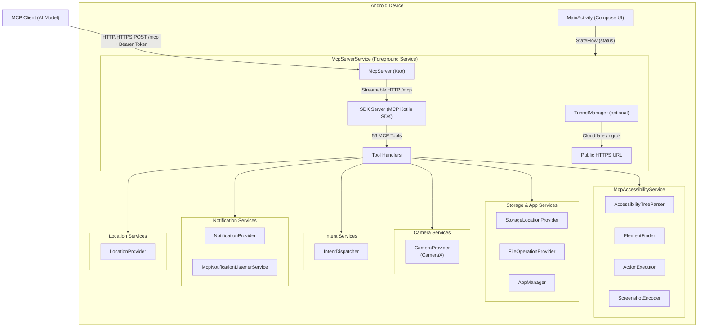

# Contributing

Thank you for your interest in contributing to Android Remote Control MCP!

## Getting Started

1. Fork the repository
2. Create a feature branch: `git checkout -b feat/your-feature`
3. Make your changes following the project conventions
4. Ensure all checks pass: `make lint && make test-unit && make build`
5. Commit with descriptive messages (e.g., `feat: add new MCP tool for ...`)
6. Open a pull request

## Development Conventions

- **Language**: Kotlin with Android (Jetpack Compose, Ktor)
- **Architecture**: Service-based with SOLID principles
- **Testing**: JUnit 5 + MockK (unit), Ktor testApplication (JVM integration), Testcontainers (E2E)
- **Linting**: ktlint + detekt
- **DI**: Hilt (Dagger-based)

See [docs/PROJECT.md](docs/PROJECT.md) for the complete project conventions.

---

## Requirements

### For Building
- **JDK 17** (e.g., [Eclipse Temurin](https://adoptium.net/))
- **Android SDK** with API 34 (Android 14)
- **Android NDK** (for cross-compiling native binaries; install via SDK Manager: `sdkmanager "ndk;<version>"`)
- **Gradle** 8.x (wrapper included, no global install needed)
- **Go** (for compiling cloudflared tunnel binary; install from [go.dev/dl](https://go.dev/dl/))
- **Rust/cargo** (for compiling ngrok native library; install from [rustup.rs](https://rustup.rs/))
- **Maven** (for compiling ngrok Java library; install from [maven.apache.org](https://maven.apache.org/install.html))

### For Running
- Android device or emulator running **Android 13+** (API 33+), targeting **Android 14** (API 34)
- **adb** (Android Debug Bridge) for device/emulator management

### For E2E Tests
- **Podman** (rootful, for `redroid/redroid` Android container image)

Check all dependencies:
```bash
make check-deps
```

---

## Building

### Debug Build

```bash
make build
# APK: app/build/outputs/apk/debug/app-debug.apk
```

### Release Build

```bash
make build-release
# APK: app/build/outputs/apk/release/app-release.apk
```

For signed release builds, create `keystore.properties` in the project root:
```properties
storeFile=path/to/your.keystore
storePassword=your_store_password
keyAlias=your_key_alias
keyPassword=your_key_password
```

### Clean Build

```bash
make clean
```

---

## Testing

### Unit Tests

```bash
make test-unit
```

Runs JUnit 5 unit tests with MockK for mocking. Tests cover accessibility tree parsing, node finding, screenshot encoding, settings repository, network utilities, and all 56 MCP tool handlers.

### Integration Tests

```bash
make test-integration
```

Runs JVM-based integration tests using Ktor `testApplication` (no device or emulator required). Tests the full HTTP stack: authentication, JSON-RPC protocol, tool dispatch for all 12 tool categories, and error handling.

> **Note**: Some integration tests (e.g., `NgrokTunnelIntegrationTest`) require environment variables. Copy `.env.example` to `.env` and fill in the required values. The Makefile sources `.env` automatically.

### E2E Tests

```bash
make test-e2e
```

Requires rootful Podman. Starts a redroid Android container via Podman, installs the app, and performs real MCP tool calls. Includes:
- **Calculator test**: 7 + 3 = 10 via MCP tools (verifies full stack)
- **Screenshot test**: Capture with different quality settings
- **Error handling test**: Authentication, unknown tools, invalid params

### All Tests

```bash
make test
```

### Code Coverage

```bash
make coverage
```

Generates a Jacoco HTML report at `app/build/reports/jacoco/jacocoTestReport/html/index.html`. Minimum coverage target: 80%.

---

## Linting

```bash
# Check for issues
make lint

# Auto-fix issues
make lint-fix
```

Uses ktlint for code style and detekt for static analysis.

---

## Architecture

The application is a **service-based Android app** with three main components:

1. **McpAccessibilityService** - UI introspection, action execution, and screenshot capture via Android Accessibility APIs (`takeScreenshot()` on Android 11+)
2. **McpServerService** - Foreground service running the Ktor HTTP/HTTPS server
3. **MainActivity** - Jetpack Compose UI for configuration and control



See [docs/ARCHITECTURE.md](docs/ARCHITECTURE.md) for detailed architecture documentation.
