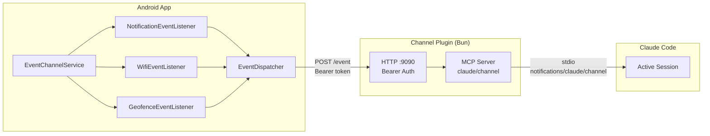

<!-- SACRED DOCUMENT — DO NOT MODIFY except for checkmarks ([ ] → [x]) and review findings. -->
<!-- You MUST NEVER alter, revert, or delete files outside the scope of this plan. -->
<!-- Plans in docs/plans/ are PERMANENT artifacts. There are ZERO exceptions. -->

# Plan 45: Event Channel System with Claude Code Channel Plugin

Implement a push-based event channel system that forwards Android device events (notifications, WiFi, geofence) to Claude Code sessions via a Claude Code Channel Plugin.

## Prerequisites

- **Bun runtime** installed on the development machine (for channel plugin development/testing)
- **Google Maps API key**: Required for geofence map UI
  1. Create a project in Google Cloud Console
  2. Enable "Maps SDK for Android"
  3. Create an API key restricted to the app's package name and SHA-1
  4. Add `MAPS_API_KEY=<your-key>` to `local.properties` (gitignored)

## Architecture Overview



---

## User Story 1: Channel Plugin (TypeScript/Bun)

Create a Claude Code channel plugin that receives HTTP POST events from the Android app and pushes them as channel notifications into Claude Code sessions.

### Acceptance Criteria

- [ ] Plugin installs via `/plugin marketplace add` or local path
- [ ] Plugin starts HTTP listener on configurable port (default 9090)
- [ ] Plugin validates bearer token on incoming requests
- [ ] Plugin pushes events as `notifications/claude/channel` to Claude Code
- [ ] Plugin prepends configurable prompt template to events
- [ ] Configuration via `/android-remote-control:configure` command or env vars
- [ ] Config stored in `~/.claude/channels/android-remote-control/.env` with `0o600` permissions

### Task 1.1: Plugin packaging structure

**Action 1.1.1** — Create `channel-plugin/.claude-plugin/plugin.json` (create)

```json
{
  "name": "android-remote-control",
  "description": "Channel plugin for Android Remote Control MCP — receives device events (notifications, WiFi, geofence) and pushes them into Claude Code sessions.",
  "version": "0.0.1",
  "keywords": ["android", "remote-control", "channel", "notifications", "geofence", "wifi"],
  "mcpServers": {
    "android-remote-control": {
      "command": "bun",
      "args": ["${CLAUDE_PLUGIN_ROOT}/index.ts"]
    }
  }
}
```

**Action 1.1.2** — Create `channel-plugin/package.json` (create)

```json
{
  "name": "android-remote-control-channel",
  "version": "0.0.1",
  "private": true,
  "type": "module",
  "dependencies": {
    "@modelcontextprotocol/sdk": "^1.12.0"
  }
}
```

**Action 1.1.3** — Run `bun install` in `channel-plugin/` to generate lockfile.

**Action 1.1.4** — Modify `.gitignore` (modify)

Add:
```
channel-plugin/node_modules/
```

**Definition of Done**:
- [ ] Plugin directory structure exists with valid `plugin.json` and `package.json`
- [ ] `bun install` succeeds and `bun.lockb` is committed
- [ ] `node_modules/` is gitignored

### Task 1.2: MCP server with channel capability and HTTP endpoint

Context: Before writing `index.ts`, the implementer MUST read the official Telegram plugin source at `external_plugins/telegram/server.ts` in the `claude-plugins-official` repo to verify the exact `notifications/claude/channel` params structure and match the notification emission format.

**Action 1.2.1** — Create `channel-plugin/index.ts` (create)

```typescript
#!/usr/bin/env bun
import { Server } from "@modelcontextprotocol/sdk/server/index.js";
import { StdioServerTransport } from "@modelcontextprotocol/sdk/server/stdio.js";
import { readFileSync, mkdirSync, chmodSync, existsSync } from "fs";
import { join } from "path";
import { timingSafeEqual } from "crypto";

// --- Config loading ---
const STATE_DIR =
  process.env.ANDROID_REMOTE_CONTROL_STATE_DIR ||
  join(process.env.HOME || "~", ".claude", "channels", "android-remote-control");

const ENV_FILE = join(STATE_DIR, ".env");

// Load .env file (env vars take precedence)
try {
  if (existsSync(ENV_FILE)) {
    chmodSync(ENV_FILE, 0o600);
    for (const line of readFileSync(ENV_FILE, "utf8").split("\n")) {
      const m = line.match(/^(\w+)=(.*)$/);
      if (m && process.env[m[1]] === undefined) {
        process.env[m[1]] = m[2];
      }
    }
  }
} catch {
  // Ignore read errors
}

const LISTEN_PORT = parseInt(process.env.LISTEN_PORT || "9090", 10);
const AUTH_TOKEN = process.env.AUTH_TOKEN || "";
const PROMPT_TEMPLATE =
  process.env.PROMPT_TEMPLATE ||
  "This is an event from the Android Remote Control MCP server. Don't take actions unless the user has specified what to do.";

if (!AUTH_TOKEN) {
  console.error(
    "AUTH_TOKEN not set. Run /android-remote-control:configure <token> or set AUTH_TOKEN env var."
  );
  process.exit(1);
}

// --- Constant-time token comparison ---
function validateToken(provided: string): boolean {
  const expected = Buffer.from(AUTH_TOKEN, "utf8");
  const actual = Buffer.from(provided, "utf8");
  if (expected.length !== actual.length) return false;
  return timingSafeEqual(expected, actual);
}

// --- MCP Server ---
const mcp = new Server(
  { name: "android-remote-control", version: "0.0.1" },
  {
    capabilities: {
      experimental: { "claude/channel": {} },
    },
    instructions: `Events from an Android device arrive as <channel> messages. ${PROMPT_TEMPLATE}`,
  }
);

await mcp.connect(new StdioServerTransport());

// --- HTTP Server ---
Bun.serve({
  port: LISTEN_PORT,
  hostname: "127.0.0.1",
  async fetch(req: Request): Promise<Response> {
    if (req.method !== "POST") {
      return new Response("Method not allowed", { status: 405 });
    }

    const url = new URL(req.url);
    if (url.pathname !== "/event") {
      return new Response("Not found", { status: 404 });
    }

    // Validate bearer token
    const auth = req.headers.get("authorization") || "";
    if (!auth.startsWith("Bearer ") || !validateToken(auth.slice(7))) {
      return new Response("Unauthorized", { status: 401 });
    }

    try {
      const event = (await req.json()) as {
        type: string;
        timestamp: string;
        data: unknown;
      };

      if (!event.type || !event.timestamp) {
        return new Response(
          JSON.stringify({ error: "Missing type or timestamp" }),
          { status: 400, headers: { "Content-Type": "application/json" } }
        );
      }

      // Format event content
      const content = [
        PROMPT_TEMPLATE,
        "",
        `Event type: ${event.type}`,
        `Timestamp: ${event.timestamp}`,
        "",
        JSON.stringify(event.data, null, 2),
      ].join("\n");

      // Push to Claude Code session
      await mcp.notification({
        method: "notifications/claude/channel",
        params: {
          channel: "android-remote-control",
          message: {
            source: "android-remote-control",
            content,
            meta: {
              sender: event.type,
            },
          },
        },
      });

      return new Response(JSON.stringify({ status: "ok" }), {
        headers: { "Content-Type": "application/json" },
      });
    } catch {
      return new Response(JSON.stringify({ error: "Invalid request body" }), {
        status: 400,
        headers: { "Content-Type": "application/json" },
      });
    }
  },
});
```

**Definition of Done**:
- [ ] Server starts, connects via stdio, and listens on HTTP port
- [ ] Auth validation works (rejects missing/invalid token, accepts valid token)
- [ ] Events are pushed to Claude Code session as channel notifications
- [ ] Prompt template is prepended to event content

### Task 1.3: Configuration CLI command

**Action 1.3.1** — Create `channel-plugin/commands/configure.md` (create)

```markdown
---
name: configure
description: Configure the Android Remote Control channel plugin
---

Configure the Android Remote Control channel plugin.

Usage: /android-remote-control:configure <auth_token> [listen_port] [prompt_template]

Arguments:
- auth_token (required): Bearer token for authenticating requests from the Android app
- listen_port (optional, default 9090): Port for the HTTP listener
- prompt_template (optional): Prompt prepended to events sent to Claude

This command writes configuration to ~/.claude/channels/android-remote-control/.env with 0o600 permissions.

When invoked:
1. Create the directory ~/.claude/channels/android-remote-control/ if it doesn't exist
2. Write the .env file with the provided values:
   AUTH_TOKEN=<auth_token>
   LISTEN_PORT=<listen_port>
   PROMPT_TEMPLATE=<prompt_template>
3. Set file permissions to 0o600 (owner read/write only)
4. Inform the user they need to restart Claude Code with the --channels flag:
   claude --channels plugin:android-remote-control@<marketplace>
   or for development:
   claude --dangerously-load-development-channels server:android-remote-control
```

**Definition of Done**:
- [ ] `/android-remote-control:configure` command is available after plugin installation
- [ ] Command writes config to correct location with correct permissions
- [ ] Command provides clear instructions for enabling the channel

---

## User Story 2: Android Build Dependencies

Add required dependencies for the event channel system.

### Acceptance Criteria

- [ ] All new dependencies added to version catalog and build.gradle.kts
- [ ] Google Maps API key placeholder configured in manifest via local.properties
- [ ] Project builds successfully with new dependencies

### Task 2.1: Version catalog entries

**Action 2.1.1** — Modify `gradle/libs.versions.toml` (modify)

Add to `[versions]`:
```toml
maps-compose = "<latest-stable>"
play-services-maps = "<latest-stable>"
```
Verify latest stable versions at implementation time. As of writing: `maps-compose` ~6.4.x, `play-services-maps` ~19.1.x. The implementer MUST verify that the chosen `maps-compose` version includes `GoogleMap`, `Marker`, `MarkerState`, `Circle`, `rememberCameraPositionState`, and `CameraUpdateFactory` APIs.

Add to `[libraries]`:
```toml
# Google Maps
maps-compose = { group = "com.google.maps.android", name = "maps-compose", version.ref = "maps-compose" }
play-services-maps = { group = "com.google.android.gms", name = "play-services-maps", version.ref = "play-services-maps" }

# Ktor Client (Event Channel dispatcher)
ktor-client-okhttp = { group = "io.ktor", name = "ktor-client-okhttp", version.ref = "ktor" }
```

Note: `ktor-serialization-kotlinx-json` is already an `implementation` dependency. `ktor-client-content-negotiation` is currently `testImplementation` only — it must be added as `implementation`. `ktor-client-okhttp` transitively pulls `ktor-client-core`. `play-services-location` is already an `implementation` dependency (used by `LocationProvider`). Using OkHttp engine for Android app and CIO engine for JVM tests is intentional — OkHttp is the standard HTTP engine for Android.

**Definition of Done**:
- [ ] Version catalog entries added
- [ ] Versions are latest stable

### Task 2.2: Build.gradle.kts dependencies

**Action 2.2.1** — Modify `app/build.gradle.kts` (modify)

Add to `dependencies` block (implementation section):
```kotlin
// Google Maps
implementation(libs.maps.compose)
implementation(libs.play.services.maps)

// Ktor Client (Event Channel dispatcher)
implementation(libs.ktor.client.okhttp)
implementation(libs.ktor.client.content.negotiation)
```

Note: `ktor-serialization-kotlinx-json` is already `implementation` (line 213). `ktor-client-content-negotiation` must be changed from `testImplementation` to `implementation` — keep the `testImplementation` line too since tests still need it, or the `implementation` scope covers tests. Do NOT install a Ktor client logging interceptor — it would expose the auth token in logs.

**Definition of Done**:
- [ ] All dependency lines added to build.gradle.kts

### Task 2.3: Google Maps API key manifest placeholder

**Action 2.3.1** — Modify `app/build.gradle.kts` (modify)

Add at the top of the `android` block (after existing property loading):
```kotlin
val localProperties = java.util.Properties()
val localPropsFile = rootProject.file("local.properties")
if (localPropsFile.exists()) {
    localProperties.load(localPropsFile.inputStream())
}
```

In `defaultConfig` block, add:
```kotlin
manifestPlaceholders["MAPS_API_KEY"] = localProperties.getProperty("MAPS_API_KEY", "")
```

**Action 2.3.2** — Modify `app/src/main/AndroidManifest.xml` (modify)

Add inside `<application>`:
```xml
<meta-data
    android:name="com.google.android.geo.API_KEY"
    android:value="${MAPS_API_KEY}" />
```

**Definition of Done**:
- [ ] Maps API key is read from `local.properties` and injected into manifest
- [ ] Build succeeds even if `MAPS_API_KEY` is not set (empty string fallback)

---

## User Story 3: Android Data Models

Define data models for event channel configuration, channel events, and notification change events.

### Acceptance Criteria

- [ ] All persisted data models are `@Serializable` (kotlinx.serialization)
- [ ] Default values match what was agreed (channel disabled by default, etc.)
- [ ] Models support JSON serialization/deserialization for DataStore persistence
- [ ] `ChannelConnectionStatus` uses `data object` for consistency with existing `ServerStatus`

### Task 3.1: Event channel configuration models

**Action 3.1.1** — Create `app/src/main/kotlin/.../data/model/EventChannelConfig.kt` (create)

```kotlin
@Serializable
data class EventChannelConfig(
    val enabled: Boolean = false,
    val endpointUrl: String = "",
    val authToken: String = "",
    val notifications: NotificationChannelConfig = NotificationChannelConfig(),
    val wifi: WifiChannelConfig = WifiChannelConfig(),
    val geofence: GeofenceChannelConfig = GeofenceChannelConfig(),
) {
    companion object {
        const val DEFAULT_ENDPOINT_URL = "http://localhost:9090"

        fun fromJson(json: String): EventChannelConfig =
            McpJson.decodeFromString(serializer(), json)

        fun fromJsonOrDefault(json: String): EventChannelConfig =
            try {
                fromJson(json)
            } catch (_: Exception) {
                EventChannelConfig()
            }
    }

    fun toJson(): String = McpJson.encodeToString(serializer(), this)
}

@Serializable
data class NotificationChannelConfig(
    val enabled: Boolean = false,
    val filterMode: NotificationFilterMode = NotificationFilterMode.ALL,
    val filterApps: Set<String> = emptySet(),
)

@Serializable
enum class NotificationFilterMode {
    ALL,
    WHITELIST,
    BLACKLIST,
}

@Serializable
data class WifiChannelConfig(
    val enabled: Boolean = false,
    val ssids: Set<String> = emptySet(),
    val notifyOnDiscovered: Boolean = true,
    val notifyOnLost: Boolean = true,
    val notifyOnConnected: Boolean = true,
    val notifyOnDisconnected: Boolean = true,
)

@Serializable
data class GeofenceChannelConfig(
    val enabled: Boolean = false,
    val zones: List<GeofenceZone> = emptyList(),
)

@Serializable
data class GeofenceZone(
    val id: String,
    val name: String,
    val latitude: Double,
    val longitude: Double,
    val radiusMeters: Float,
    val notifyOnEnter: Boolean = true,
    val notifyOnExit: Boolean = true,
)
```

Note: Uses the existing `McpJson` instance from `McpServer.kt` for consistent serialization config. If `McpJson` is not accessible, use `Json { ignoreUnknownKeys = true }`.

**Action 3.1.2** — Create `app/src/main/kotlin/.../data/model/ChannelConnectionStatus.kt` (create)

```kotlin
sealed class ChannelConnectionStatus {
    data object Idle : ChannelConnectionStatus()
    data object Active : ChannelConnectionStatus()
    data class Error(val message: String) : ChannelConnectionStatus()
}
```

Uses `data object` for consistency with existing `ServerStatus` pattern.

**Definition of Done**:
- [ ] All model classes compile
- [ ] JSON serialization round-trips correctly for all `@Serializable` models

### Task 3.2: Channel event models

**Action 3.2.1** — Create `app/src/main/kotlin/.../data/model/ChannelEvent.kt` (create)

```kotlin
@Serializable
data class ChannelEvent(
    val type: String,
    val timestamp: String,
    val data: JsonElement,
)
```

**Action 3.2.2** — Create `app/src/main/kotlin/.../data/model/ChannelEventFactory.kt` (create)

`NotificationData` is NOT `@Serializable` (it's an existing model with `NotificationActionData` containing non-serializable types). The factory manually builds `JsonObject` from its fields.

```kotlin
object ChannelEventFactory {
    private fun nowIso8601(): String =
        java.time.Instant.now().toString()

    fun notification(notification: NotificationData, eventType: String): ChannelEvent =
        ChannelEvent(
            type = "notification",
            timestamp = nowIso8601(),
            data = buildJsonObject {
                put("eventType", eventType)
                put("notificationId", notification.notificationId)
                put("packageName", notification.packageName)
                put("appName", notification.appName)
                put("title", notification.title?.let { JsonPrimitive(it) } ?: JsonNull)
                put("text", notification.text?.let { JsonPrimitive(it) } ?: JsonNull)
                put("bigText", notification.bigText?.let { JsonPrimitive(it) } ?: JsonNull)
                put("subText", notification.subText?.let { JsonPrimitive(it) } ?: JsonNull)
                put("timestamp", notification.timestamp)
                put("isOngoing", notification.isOngoing)
                put("isClearable", notification.isClearable)
                put("category", notification.category?.let { JsonPrimitive(it) } ?: JsonNull)
                put("groupKey", notification.groupKey?.let { JsonPrimitive(it) } ?: JsonNull)
                put("actions", buildJsonArray {
                    for (action in notification.actions) {
                        add(buildJsonObject {
                            put("actionId", action.actionId)
                            put("index", action.index)
                            put("title", action.title)
                            put("acceptsText", action.acceptsText)
                        })
                    }
                })
            },
        )

    fun wifi(ssid: String, eventType: String, bssid: String?): ChannelEvent =
        ChannelEvent(
            type = "wifi",
            timestamp = nowIso8601(),
            data = buildJsonObject {
                put("ssid", ssid)
                put("eventType", eventType)
                put("bssid", bssid?.let { JsonPrimitive(it) } ?: JsonNull)
            },
        )

    fun geofence(zone: GeofenceZone, transition: String): ChannelEvent =
        ChannelEvent(
            type = "geofence",
            timestamp = nowIso8601(),
            data = buildJsonObject {
                put("zoneId", zone.id)
                put("zoneName", zone.name)
                put("transition", transition)
                put("latitude", zone.latitude)
                put("longitude", zone.longitude)
                put("radiusMeters", zone.radiusMeters)
            },
        )
}
```

**Definition of Done**:
- [ ] Factory produces valid JSON for all three event types
- [ ] All NotificationData fields present in notification event data

### Task 3.3: Notification change event model

**Action 3.3.1** — Create `app/src/main/kotlin/.../data/model/NotificationChangeEvent.kt` (create)

```kotlin
data class NotificationChangeEvent(
    val eventType: NotificationChangeType,
    val notification: NotificationData,
)

enum class NotificationChangeType {
    POSTED,
    REMOVED,
}
```

Internal model — not serialized to JSON, not persisted.

**Definition of Done**:
- [ ] Model compiles and can hold NotificationData instances

---

## User Story 4: Android Settings Repository

Extend `SettingsRepository` to persist event channel configuration.

### Acceptance Criteria

- [ ] `EventChannelConfig` persisted as JSON string in DataStore
- [ ] `eventChannelConfig: Flow<EventChannelConfig>` emits on changes
- [ ] Individual update methods for each setting (following existing pattern)
- [ ] Validation for endpoint URL format
- [ ] Validation rejects starting the channel with empty endpoint URL or auth token

### Task 4.1: SettingsRepository interface extensions

**Action 4.1.1** — Modify `app/src/main/kotlin/.../data/repository/SettingsRepository.kt` (modify)

Add to interface:
```kotlin
// Event Channel
val eventChannelConfig: Flow<EventChannelConfig>
suspend fun getEventChannelConfig(): EventChannelConfig
suspend fun updateEventChannelEnabled(enabled: Boolean)
suspend fun updateEventChannelEndpointUrl(url: String)
suspend fun updateEventChannelAuthToken(token: String)
suspend fun generateNewEventChannelAuthToken(): String
fun validateEndpointUrl(url: String): Result<String>

// Notification channel
suspend fun updateNotificationChannelEnabled(enabled: Boolean)
suspend fun updateNotificationFilterMode(mode: NotificationFilterMode)
suspend fun updateNotificationFilterApps(apps: Set<String>)

// WiFi channel
suspend fun updateWifiChannelEnabled(enabled: Boolean)
suspend fun updateWifiSsids(ssids: Set<String>)
suspend fun updateWifiNotifyOnDiscovered(enabled: Boolean)
suspend fun updateWifiNotifyOnLost(enabled: Boolean)
suspend fun updateWifiNotifyOnConnected(enabled: Boolean)
suspend fun updateWifiNotifyOnDisconnected(enabled: Boolean)

// Geofence channel
suspend fun updateGeofenceChannelEnabled(enabled: Boolean)
suspend fun addGeofenceZone(zone: GeofenceZone)
suspend fun removeGeofenceZone(zoneId: String)
suspend fun updateGeofenceZone(zone: GeofenceZone)
```

**Definition of Done**:
- [ ] Interface compiles with all new methods

### Task 4.2: SettingsRepositoryImpl extensions

**Action 4.2.1** — Modify `app/src/main/kotlin/.../data/repository/SettingsRepositoryImpl.kt` (modify)

Add DataStore key:
```kotlin
private val EVENT_CHANNEL_CONFIG = stringPreferencesKey("event_channel_config")
```

Implement all interface methods following the existing `ToolPermissionsConfig` JSON persistence pattern:
- `eventChannelConfig` maps the DataStore flow, deserializes JSON via `EventChannelConfig.fromJsonOrDefault()`, emits `EventChannelConfig`
- `getEventChannelConfig()` reads first value from `eventChannelConfig` flow
- Each `update*` method: reads current config via `getEventChannelConfig()`, creates copy with changed field, serializes to JSON via `toJson()`, writes to DataStore
- `validateEndpointUrl()`: checks for valid HTTP/HTTPS URL format using `java.net.URL` constructor (throws on invalid). Rejects empty strings. Returns `Result.success(url)` or `Result.failure(IllegalArgumentException(message))`
- `generateNewEventChannelAuthToken()`: generates UUID via `java.util.UUID.randomUUID().toString()`, updates config, returns token
- `addGeofenceZone()`: reads config, appends zone to `geofence.zones`, writes back
- `removeGeofenceZone()`: reads config, filters out zone by ID, writes back
- `updateGeofenceZone()`: reads config, replaces zone with matching ID, writes back

**Definition of Done**:
- [ ] All settings persist across app restarts
- [ ] Flow emits updates when config changes
- [ ] URL validation rejects invalid formats and empty strings

---

## User Story 5: Android Event Dispatcher

HTTP client that POSTs channel events to the channel plugin endpoint.

### Acceptance Criteria

- [ ] POSTs JSON events to configured endpoint URL
- [ ] Includes `Authorization: Bearer <token>` header
- [ ] Tracks connection status (Idle/Active/Error)
- [ ] Handles connection errors gracefully (logs, updates status, does not crash)

### Task 5.1: EventDispatcher interface

**Action 5.1.1** — Create `app/src/main/kotlin/.../services/channel/EventDispatcher.kt` (create)

```kotlin
interface EventDispatcher {
    val connectionStatus: StateFlow<ChannelConnectionStatus>
    suspend fun dispatch(event: ChannelEvent): Result<Unit>
    fun start(endpointUrl: String, authToken: String)
    fun stop()
}
```

**Definition of Done**:
- [ ] Interface compiles

### Task 5.2: EventDispatcherImpl

**Action 5.2.1** — Create `app/src/main/kotlin/.../services/channel/EventDispatcherImpl.kt` (create)

```kotlin
@Singleton
class EventDispatcherImpl @Inject constructor() : EventDispatcher {
    private val _connectionStatus = MutableStateFlow<ChannelConnectionStatus>(ChannelConnectionStatus.Idle)
    override val connectionStatus: StateFlow<ChannelConnectionStatus> = _connectionStatus.asStateFlow()

    @Volatile private var client: HttpClient? = null
    @Volatile private var endpointUrl: String = ""
    @Volatile private var authToken: String = ""

    override fun start(endpointUrl: String, authToken: String) {
        this.endpointUrl = endpointUrl
        this.authToken = authToken
        // No Logging plugin installed — it would expose the auth token in logs
        client = HttpClient(OkHttp) {
            install(ContentNegotiation) {
                json(Json { ignoreUnknownKeys = true })
            }
        }
        _connectionStatus.value = ChannelConnectionStatus.Idle
        Logger.i(TAG, "Event dispatcher started, endpoint=$endpointUrl")
    }

    override fun stop() {
        client?.close()
        client = null
        _connectionStatus.value = ChannelConnectionStatus.Idle
        Logger.i(TAG, "Event dispatcher stopped")
    }

    override suspend fun dispatch(event: ChannelEvent): Result<Unit> =
        withContext(Dispatchers.IO) {
            val httpClient = client ?: return@withContext Result.failure(
                IllegalStateException("Dispatcher not started")
            )
            try {
                val response = httpClient.post("$endpointUrl/event") {
                    contentType(ContentType.Application.Json)
                    header("Authorization", "Bearer $authToken")
                    setBody(event)
                }
                if (response.status.isSuccess()) {
                    _connectionStatus.value = ChannelConnectionStatus.Active
                    Result.success(Unit)
                } else {
                    val msg = "HTTP ${response.status.value}"
                    _connectionStatus.value = ChannelConnectionStatus.Error(msg)
                    Logger.w(TAG, "Dispatch failed: $msg")
                    Result.failure(IOException(msg))
                }
            } catch (e: Exception) {
                val msg = e.message ?: "Unknown error"
                _connectionStatus.value = ChannelConnectionStatus.Error(msg)
                Logger.w(TAG, "Dispatch error: $msg")
                Result.failure(e)
            }
        }

    companion object {
        private const val TAG = "MCP:EventDispatcher"
    }
}
```

**Definition of Done**:
- [ ] Dispatches events via HTTP POST with correct headers and body
- [ ] Connection status reflects last dispatch result
- [ ] Network errors are caught and reported via status, not thrown

---

## User Story 6: Android Notification Event Source

Forward device notifications to the event channel, with filtering by app.

### Acceptance Criteria

- [ ] `McpNotificationListenerService` emits `NotificationChangeEvent` on notification posted/removed
- [ ] `NotificationEventListener` subscribes to events, applies filter, dispatches via `EventDispatcher`
- [ ] Filter modes work correctly: ALL, WHITELIST, BLACKLIST
- [ ] Notification data includes all fields from existing `NotificationData` model

### Task 6.1: Extract notification conversion to shared utility

**Action 6.1.1** — Create `app/src/main/kotlin/.../services/notifications/NotificationDataExtractor.kt` (create)

Extract the `StatusBarNotification → NotificationData` conversion logic from `NotificationProviderImpl.toNotificationData()` into a new standalone utility. The existing method takes `appNameCache: MutableMap<String, String>` — the extractor must maintain its own internal cache for the service's `onNotificationPosted` path (called per-notification, not in batch).

```kotlin
object NotificationDataExtractor {
    private val appNameCache = ConcurrentHashMap<String, String>()

    fun extract(sbn: StatusBarNotification, context: Context): NotificationData {
        val notification = sbn.notification
        val extras = notification.extras
        val appName = appNameCache.getOrPut(sbn.packageName) {
            val pm = context.packageManager
            try {
                pm.getApplicationLabel(
                    pm.getApplicationInfo(sbn.packageName, PackageManager.ApplicationInfoFlags.of(0))
                ).toString()
            } catch (_: PackageManager.NameNotFoundException) {
                sbn.packageName
            }
        }
        // Implementer: copy the EXACT remaining logic from
        // NotificationProviderImpl.toNotificationData() — extract title, text, bigText,
        // subText from extras, hash the notification key for notificationId,
        // extract actions with RemoteInput detection.
        // The method signature and return type are identical.
        // The only difference: appNameCache is ConcurrentHashMap (thread-safe).
    }
}
```

The implementer MUST copy the exact logic from `NotificationProviderImpl.toNotificationData()`. The method body is identical except for the `ConcurrentHashMap` cache (thread-safe for concurrent access from `onNotificationPosted` on main thread and `NotificationProviderImpl` from IO dispatcher).

**Action 6.1.2** — Modify `app/src/main/kotlin/.../services/notifications/NotificationProviderImpl.kt` (modify)

Replace the private `toNotificationData()` method body to delegate to the new extractor:

```kotlin
private fun toNotificationData(
    sbn: StatusBarNotification,
    appNameCache: MutableMap<String, String>,
): NotificationData = NotificationDataExtractor.extract(sbn, context)
```

The `appNameCache` parameter becomes unused after this change. The extractor manages its own cache internally. Remove the `appNameCache` parameter from the method signature and update all call sites within `NotificationProviderImpl`.

**Definition of Done**:
- [ ] Existing `NotificationProviderImpl` delegates to the extractor
- [ ] Extractor is independently callable from McpNotificationListenerService

### Task 6.2: McpNotificationListenerService event emission

**Action 6.2.1** — Modify `app/src/main/kotlin/.../services/notifications/McpNotificationListenerService.kt` (modify)

Add to companion object:
```kotlin
private val _notificationChangeEvents = MutableSharedFlow<NotificationChangeEvent>(
    extraBufferCapacity = 64,
    onBufferOverflow = BufferOverflow.DROP_OLDEST,
)
val notificationChangeEvents: SharedFlow<NotificationChangeEvent> =
    _notificationChangeEvents.asSharedFlow()
```

Add overrides:
```kotlin
override fun onNotificationPosted(sbn: StatusBarNotification) {
    val data = NotificationDataExtractor.extract(sbn, applicationContext)
    // Skip empty notifications (same filter as NotificationProviderImpl)
    if (data.title == null && data.text == null && data.bigText == null && data.actions.isEmpty()) {
        return
    }
    _notificationChangeEvents.tryEmit(
        NotificationChangeEvent(NotificationChangeType.POSTED, data)
    )
}

override fun onNotificationRemoved(sbn: StatusBarNotification) {
    val data = NotificationDataExtractor.extract(sbn, applicationContext)
    _notificationChangeEvents.tryEmit(
        NotificationChangeEvent(NotificationChangeType.REMOVED, data)
    )
}
```

**Definition of Done**:
- [ ] Events emitted on notification posted/removed
- [ ] Empty notifications skipped on posted (consistent with existing provider)

### Task 6.3: NotificationEventListener

**Action 6.3.1** — Create `app/src/main/kotlin/.../services/channel/listeners/NotificationEventListener.kt` (create)

Listeners are constructed manually by `EventChannelService` because they require the service's `CoroutineScope` (only available at runtime, not at Hilt injection time).

```kotlin
class NotificationEventListener(
    private val eventDispatcher: EventDispatcher,
    private val scope: CoroutineScope,
) {
    private var job: Job? = null
    @Volatile
    private var currentConfig: NotificationChannelConfig = NotificationChannelConfig()

    fun start(config: NotificationChannelConfig) {
        currentConfig = config
        job = scope.launch {
            McpNotificationListenerService.notificationChangeEvents.collect { event ->
                val cfg = currentConfig
                if (shouldForward(event.notification.packageName, cfg)) {
                    val channelEvent = ChannelEventFactory.notification(
                        event.notification,
                        event.eventType.name.lowercase(),
                    )
                    eventDispatcher.dispatch(channelEvent)
                }
            }
        }
    }

    fun stop() {
        job?.cancel()
        job = null
    }

    fun updateConfig(config: NotificationChannelConfig) {
        currentConfig = config
    }

    private fun shouldForward(packageName: String, config: NotificationChannelConfig): Boolean =
        when (config.filterMode) {
            NotificationFilterMode.ALL -> true
            NotificationFilterMode.WHITELIST -> packageName in config.filterApps
            NotificationFilterMode.BLACKLIST -> packageName !in config.filterApps
        }

    companion object {
        private const val TAG = "MCP:NotifEventListener"
    }
}
```

Config reference is `@Volatile` for thread-safe reads from the collector coroutine while `updateConfig()` is called from the service's config observer.

**Definition of Done**:
- [ ] Notification events flow from system -> service -> listener -> dispatcher
- [ ] Filtering correctly includes/excludes apps based on mode
- [ ] Empty notifications are skipped (at the service emission level)

---

## User Story 7: Android WiFi Event Source

Monitor WiFi networks for configured SSIDs and send discovery/loss/connection/disconnection events.

### Acceptance Criteria

- [ ] Detects WiFi scan results for configured SSIDs (discovered/lost)
- [ ] Detects WiFi connection/disconnection for configured SSIDs
- [ ] Events dispatched via `EventDispatcher`
- [ ] WiFi scan throttling limitations documented in UI
- [ ] `ACCESS_WIFI_STATE`, `CHANGE_WIFI_STATE`, and `NEARBY_WIFI_DEVICES` permissions declared

### Task 7.1: WifiEventListener

**Action 7.1.1** — Create `app/src/main/kotlin/.../services/channel/listeners/WifiEventListener.kt` (create)

```kotlin
class WifiEventListener(
    private val eventDispatcher: EventDispatcher,
    private val scope: CoroutineScope,
) {
    @Volatile
    private var currentConfig: WifiChannelConfig = WifiChannelConfig()
    private val previouslySeen = ConcurrentHashMap.newKeySet<String>()
    @Volatile
    private var connectedSsid: String? = null

    private var appContext: Context? = null
    private var scanReceiver: BroadcastReceiver? = null
    private var networkCallback: ConnectivityManager.NetworkCallback? = null
    private var scanJob: Job? = null
    private var wifiManager: WifiManager? = null
    private var connectivityManager: ConnectivityManager? = null

    fun start(config: WifiChannelConfig, context: Context) {
        currentConfig = config
        appContext = context.applicationContext
        wifiManager = context.getSystemService(WifiManager::class.java)
        connectivityManager = context.getSystemService(ConnectivityManager::class.java)

        // Scan-based events (discovered/lost)
        scanReceiver = object : BroadcastReceiver() {
            override fun onReceive(ctx: Context, intent: Intent) {
                handleScanResults()
            }
        }
        appContext!!.registerReceiver(
            scanReceiver,
            IntentFilter(WifiManager.SCAN_RESULTS_AVAILABLE_ACTION),
        )

        // Connection-based events
        val request = NetworkRequest.Builder()
            .addTransportType(NetworkCapabilities.TRANSPORT_WIFI)
            .build()
        networkCallback = object : ConnectivityManager.NetworkCallback() {
            override fun onCapabilitiesChanged(
                network: Network,
                caps: NetworkCapabilities,
            ) {
                val wifiInfo = caps.transportInfo as? android.net.wifi.WifiInfo ?: return
                val ssid = wifiInfo.ssid?.removeSurrounding("\"") ?: return
                if (ssid in currentConfig.ssids && connectedSsid != ssid) {
                    connectedSsid = ssid
                    if (currentConfig.notifyOnConnected) {
                        scope.launch {
                            eventDispatcher.dispatch(
                                ChannelEventFactory.wifi(ssid, "connected", wifiInfo.bssid)
                            )
                        }
                    }
                }
            }

            override fun onLost(network: Network) {
                val ssid = connectedSsid ?: return
                connectedSsid = null
                if (ssid in currentConfig.ssids && currentConfig.notifyOnDisconnected) {
                    scope.launch {
                        eventDispatcher.dispatch(
                            ChannelEventFactory.wifi(ssid, "disconnected", null)
                        )
                    }
                }
            }
        }
        connectivityManager?.registerNetworkCallback(request, networkCallback!!)

        // Periodic scan trigger (throttled by Android: ~4/2min foreground, ~1/30min background)
        // WifiManager.startScan() is deprecated since API 28 but there is NO non-deprecated
        // replacement for triggering WiFi scans. Android provides no successor API — apps must
        // either use startScan() or rely solely on passive scan results from the system.
        // This @Suppress is genuinely unavoidable per CLAUDE.md linting suppression rules.
        // The existing McpNotificationListenerService also uses @Suppress("DEPRECATION") for
        // onTrimMemory() under the same rationale. Scan-based events are best-effort;
        // connection events are real-time and not deprecated.
        scanJob = scope.launch {
            while (isActive) {
                @Suppress("DEPRECATION")
                wifiManager?.startScan()
                delay(SCAN_INTERVAL_MS)
            }
        }
    }

    fun stop() {
        scanJob?.cancel()
        scanJob = null
        scanReceiver?.let { receiver -> appContext?.unregisterReceiver(receiver) }
        networkCallback?.let { connectivityManager?.unregisterNetworkCallback(it) }
        scanReceiver = null
        networkCallback = null
        appContext = null
        previouslySeen.clear()
        connectedSsid = null
    }

    fun updateConfig(config: WifiChannelConfig) {
        currentConfig = config
    }

    @Suppress("DEPRECATION") // ScanResult.SSID deprecated API 33; getWifiSsid() returns WifiSsid
    // object not directly comparable to String. No non-deprecated String SSID accessor exists.
    private fun handleScanResults() {
        val cfg = currentConfig
        val results = wifiManager?.scanResults ?: return
        val currentSsids = results
            .mapNotNull { it.SSID }
            .filter { it in cfg.ssids }
            .toSet()

        // Discovered
        if (cfg.notifyOnDiscovered) {
            for (ssid in currentSsids - previouslySeen) {
                val bssid = results.firstOrNull { it.SSID == ssid }?.BSSID
                scope.launch {
                    eventDispatcher.dispatch(ChannelEventFactory.wifi(ssid, "discovered", bssid))
                }
            }
        }

        // Lost
        if (cfg.notifyOnLost) {
            for (ssid in previouslySeen - currentSsids) {
                scope.launch {
                    eventDispatcher.dispatch(ChannelEventFactory.wifi(ssid, "lost", null))
                }
            }
        }

        previouslySeen.clear()
        previouslySeen.addAll(currentSsids)
    }

    companion object {
        private const val TAG = "MCP:WifiEventListener"
        private const val SCAN_INTERVAL_MS = 120_000L // 2 minutes
    }
}
```

Uses `ConcurrentHashMap.newKeySet()` for thread-safe previously-seen set (BroadcastReceiver callback runs on main thread, set also accessed by `stop()`). Config reference is `@Volatile`. Application context stored in `appContext` field for receiver unregistration in `stop()`.

**Definition of Done**:
- [ ] Discovered/lost events fire based on scan results for configured SSIDs
- [ ] Connected/disconnected events fire in real-time
- [ ] Event type toggles are respected
- [ ] Receivers/callbacks properly unregistered on stop

---

## User Story 8: Android Geofence Event Source

Monitor geofence enter/exit transitions using Google Play Services GeofencingClient.

### Acceptance Criteria

- [ ] Geofence zones registered with `GeofencingClient`
- [ ] Enter/exit transitions detected and dispatched as events
- [ ] Works in background with `ACCESS_BACKGROUND_LOCATION`
- [ ] Zones dynamically add/removable at runtime
- [ ] `GeofenceTransitionReceiver` forwards raw event data to `EventChannelService` via intent

### Task 8.1: GeofenceManager interface and implementation

**Action 8.1.1** — Create `app/src/main/kotlin/.../services/channel/geofence/GeofenceManager.kt` (create)

```kotlin
interface GeofenceManager {
    suspend fun addGeofence(zone: GeofenceZone): Result<Unit>
    suspend fun removeGeofence(zoneId: String): Result<Unit>
    suspend fun removeAllGeofences(): Result<Unit>
    suspend fun syncGeofences(zones: List<GeofenceZone>): Result<Unit>
}
```

**Action 8.1.2** — Create `app/src/main/kotlin/.../services/channel/geofence/GeofenceManagerImpl.kt` (create)

```kotlin
@Singleton
class GeofenceManagerImpl @Inject constructor(
    @ApplicationContext private val context: Context,
) : GeofenceManager {
    private val geofencingClient: GeofencingClient = LocationServices.getGeofencingClient(context)

    private val pendingIntent: PendingIntent by lazy {
        val intent = Intent(context, GeofenceTransitionReceiver::class.java)
        PendingIntent.getBroadcast(
            context, 0, intent,
            PendingIntent.FLAG_UPDATE_CURRENT or PendingIntent.FLAG_MUTABLE,
        )
    }

    override suspend fun addGeofence(zone: GeofenceZone): Result<Unit> =
        withContext(Dispatchers.IO) {
            try {
                var transitionTypes = 0
                if (zone.notifyOnEnter) transitionTypes = transitionTypes or Geofence.GEOFENCE_TRANSITION_ENTER
                if (zone.notifyOnExit) transitionTypes = transitionTypes or Geofence.GEOFENCE_TRANSITION_EXIT

                val geofence = Geofence.Builder()
                    .setRequestId(zone.id)
                    .setCircularRegion(zone.latitude, zone.longitude, zone.radiusMeters)
                    .setExpirationDuration(Geofence.NEVER_EXPIRE)
                    .setTransitionTypes(transitionTypes)
                    .build()

                val request = GeofencingRequest.Builder()
                    .setInitialTrigger(
                        if (zone.notifyOnEnter) GeofencingRequest.INITIAL_TRIGGER_ENTER else 0
                    )
                    .addGeofence(geofence)
                    .build()

                geofencingClient.addGeofences(request, pendingIntent).await()
                Result.success(Unit)
            } catch (e: Exception) {
                Logger.e(TAG, "Failed to add geofence ${zone.id}: ${e.message}")
                Result.failure(e)
            }
        }

    override suspend fun removeGeofence(zoneId: String): Result<Unit> =
        withContext(Dispatchers.IO) {
            try {
                geofencingClient.removeGeofences(listOf(zoneId)).await()
                Result.success(Unit)
            } catch (e: Exception) {
                Logger.e(TAG, "Failed to remove geofence $zoneId: ${e.message}")
                Result.failure(e)
            }
        }

    override suspend fun removeAllGeofences(): Result<Unit> =
        withContext(Dispatchers.IO) {
            try {
                geofencingClient.removeGeofences(pendingIntent).await()
                Result.success(Unit)
            } catch (e: Exception) {
                Logger.e(TAG, "Failed to remove all geofences: ${e.message}")
                Result.failure(e)
            }
        }

    override suspend fun syncGeofences(zones: List<GeofenceZone>): Result<Unit> {
        removeAllGeofences()
        for (zone in zones) {
            val result = addGeofence(zone)
            if (result.isFailure) return result
        }
        return Result.success(Unit)
    }

    companion object {
        private const val TAG = "MCP:GeofenceManager"
    }
}
```

`PendingIntent` uses `FLAG_MUTABLE` because `GeofencingClient` requires it to populate the intent with transition data. The receiver is not exported, mitigating the security concern.

**Definition of Done**:
- [ ] Geofences register/unregister with GeofencingClient

### Task 8.2: GeofenceTransitionReceiver

**Action 8.2.1** — Create `app/src/main/kotlin/.../services/channel/geofence/GeofenceTransitionReceiver.kt` (create)

The receiver does NOT look up zones or access repositories. It extracts raw transition data from the GeofencingEvent and forwards it to `EventChannelService` via intent. The service performs the zone lookup and event dispatch.

```kotlin
class GeofenceTransitionReceiver : BroadcastReceiver() {
    override fun onReceive(context: Context, intent: Intent) {
        val event = GeofencingEvent.fromIntent(intent) ?: return
        if (event.hasError()) {
            Logger.e(TAG, "Geofence error: ${event.errorCode}")
            return
        }

        val transition = when (event.geofenceTransition) {
            Geofence.GEOFENCE_TRANSITION_ENTER -> "enter"
            Geofence.GEOFENCE_TRANSITION_EXIT -> "exit"
            else -> return
        }

        for (geofence in event.triggeringGeofences ?: emptyList()) {
            val serviceIntent = Intent(context, EventChannelService::class.java).apply {
                action = EventChannelService.ACTION_GEOFENCE_EVENT
                putExtra(EventChannelService.EXTRA_GEOFENCE_ZONE_ID, geofence.requestId)
                putExtra(EventChannelService.EXTRA_GEOFENCE_TRANSITION, transition)
            }
            context.startForegroundService(serviceIntent)
        }
    }

    companion object {
        private const val TAG = "MCP:GeofenceReceiver"
    }
}
```

**Definition of Done**:
- [ ] Receiver extracts transition data and forwards via intent
- [ ] No DI dependencies (uses intent-based forwarding)

### Task 8.3: GeofenceEventListener

**Action 8.3.1** — Create `app/src/main/kotlin/.../services/channel/listeners/GeofenceEventListener.kt` (create)

```kotlin
class GeofenceEventListener(
    private val eventDispatcher: EventDispatcher,
    private val geofenceManager: GeofenceManager,
    private val scope: CoroutineScope,
) {
    @Volatile
    private var currentConfig: GeofenceChannelConfig = GeofenceChannelConfig()

    fun start(config: GeofenceChannelConfig) {
        currentConfig = config
        scope.launch {
            geofenceManager.syncGeofences(config.zones)
        }
    }

    fun stop() {
        scope.launch {
            geofenceManager.removeAllGeofences()
        }
    }

    fun updateConfig(config: GeofenceChannelConfig) {
        currentConfig = config
        scope.launch {
            geofenceManager.syncGeofences(config.zones)
        }
    }

    suspend fun handleTransition(zoneId: String, transition: String) {
        val zone = currentConfig.zones.find { it.id == zoneId } ?: run {
            Logger.w(TAG, "Geofence zone not found: $zoneId")
            return
        }
        val event = ChannelEventFactory.geofence(zone, transition)
        eventDispatcher.dispatch(event)
    }

    companion object {
        private const val TAG = "MCP:GeofenceListener"
    }
}
```

**Definition of Done**:
- [ ] Geofences sync on start/updateConfig
- [ ] Enter/exit transitions produce channel events via handleTransition
- [ ] Zones survive app restart (re-registered on service start via syncGeofences)
- [ ] Permission errors handled gracefully (GeofenceManager returns Result)

---

## User Story 9: Android Event Channel Service

Foreground service that orchestrates event listeners and manages the event channel lifecycle.

### Acceptance Criteria

- [ ] Starts as foreground service with persistent notification
- [ ] Creates and manages NotificationEventListener, WifiEventListener, GeofenceEventListener
- [ ] Observes `EventChannelConfig` changes and reconfigures listeners dynamically
- [ ] Starts on boot if channel was enabled
- [ ] Independent from McpServerService (can run without MCP server)
- [ ] Validates endpoint URL and auth token are non-empty before starting

### Task 9.1: EventChannelService foreground service

**Action 9.1.1** — Create `app/src/main/kotlin/.../services/channel/EventChannelService.kt` (create)

```kotlin
@AndroidEntryPoint
class EventChannelService : Service() {
    @Inject lateinit var settingsRepository: SettingsRepository
    @Inject lateinit var eventDispatcher: EventDispatcher
    @Inject lateinit var geofenceManager: GeofenceManager

    private var notificationEventListener: NotificationEventListener? = null
    private var wifiEventListener: WifiEventListener? = null
    private var geofenceEventListener: GeofenceEventListener? = null
    private val serviceScope = CoroutineScope(SupervisorJob() + Dispatchers.Main)

    companion object {
        const val ACTION_START = "com.danielealbano.androidremotecontrolmcp.channel.START"
        const val ACTION_STOP = "com.danielealbano.androidremotecontrolmcp.channel.STOP"
        const val ACTION_GEOFENCE_EVENT = "com.danielealbano.androidremotecontrolmcp.channel.GEOFENCE_EVENT"
        const val EXTRA_GEOFENCE_ZONE_ID = "geofence_zone_id"
        const val EXTRA_GEOFENCE_TRANSITION = "geofence_transition"

        private const val NOTIFICATION_ID = 2
        private const val CHANNEL_ID = "event_channel_status"
        private const val TAG = "MCP:EventChannelService"

        private val _serviceStatus = MutableStateFlow<ChannelConnectionStatus>(
            ChannelConnectionStatus.Idle
        )
        val serviceStatus: StateFlow<ChannelConnectionStatus> = _serviceStatus.asStateFlow()
    }

    override fun onBind(intent: Intent?): IBinder? = null

    override fun onStartCommand(intent: Intent?, flags: Int, startId: Int): Int {
        when (intent?.action) {
            ACTION_START -> handleStart()
            ACTION_STOP -> handleStop()
            ACTION_GEOFENCE_EVENT -> handleGeofenceEvent(intent)
        }
        return START_STICKY
    }

    private fun handleStart() {
        createNotificationChannel()
        val notification = buildForegroundNotification()
        startForeground(NOTIFICATION_ID, notification, ServiceInfo.FOREGROUND_SERVICE_TYPE_LOCATION)

        serviceScope.launch {
            val config = settingsRepository.getEventChannelConfig()
            if (config.endpointUrl.isBlank() || config.authToken.isBlank()) {
                Logger.e(TAG, "Cannot start: endpoint URL or auth token is empty")
                stopSelf()
                return@launch
            }

            eventDispatcher.start(config.endpointUrl, config.authToken)

            serviceScope.launch {
                eventDispatcher.connectionStatus.collect { _serviceStatus.value = it }
            }

            startListeners(config)

            settingsRepository.eventChannelConfig.collect { newConfig ->
                if (!newConfig.enabled) { handleStop(); return@collect }
                reconfigureListeners(newConfig)
            }
        }
    }

    private fun handleStop() {
        notificationEventListener?.stop(); notificationEventListener = null
        wifiEventListener?.stop(); wifiEventListener = null
        geofenceEventListener?.stop(); geofenceEventListener = null
        eventDispatcher.stop()
        _serviceStatus.value = ChannelConnectionStatus.Idle
        stopForeground(STOP_FOREGROUND_REMOVE)
        stopSelf()
    }

    private fun handleGeofenceEvent(intent: Intent) {
        val zoneId = intent.getStringExtra(EXTRA_GEOFENCE_ZONE_ID) ?: return
        val transition = intent.getStringExtra(EXTRA_GEOFENCE_TRANSITION) ?: return
        serviceScope.launch { geofenceEventListener?.handleTransition(zoneId, transition) }
    }

    private fun startListeners(config: EventChannelConfig) {
        if (config.notifications.enabled) {
            notificationEventListener = NotificationEventListener(eventDispatcher, serviceScope)
            notificationEventListener?.start(config.notifications)
        }
        if (config.wifi.enabled) {
            wifiEventListener = WifiEventListener(eventDispatcher, serviceScope)
            wifiEventListener?.start(config.wifi, applicationContext)
        }
        if (config.geofence.enabled) {
            geofenceEventListener = GeofenceEventListener(eventDispatcher, geofenceManager, serviceScope)
            geofenceEventListener?.start(config.geofence)
        }
    }

    private fun reconfigureListeners(config: EventChannelConfig) {
        if (config.notifications.enabled && notificationEventListener == null) {
            notificationEventListener = NotificationEventListener(eventDispatcher, serviceScope)
            notificationEventListener?.start(config.notifications)
        } else if (!config.notifications.enabled) {
            notificationEventListener?.stop(); notificationEventListener = null
        } else {
            notificationEventListener?.updateConfig(config.notifications)
        }
        if (config.wifi.enabled && wifiEventListener == null) {
            wifiEventListener = WifiEventListener(eventDispatcher, serviceScope)
            wifiEventListener?.start(config.wifi, applicationContext)
        } else if (!config.wifi.enabled) {
            wifiEventListener?.stop(); wifiEventListener = null
        } else {
            wifiEventListener?.updateConfig(config.wifi)
        }
        if (config.geofence.enabled && geofenceEventListener == null) {
            geofenceEventListener = GeofenceEventListener(eventDispatcher, geofenceManager, serviceScope)
            geofenceEventListener?.start(config.geofence)
        } else if (!config.geofence.enabled) {
            geofenceEventListener?.stop(); geofenceEventListener = null
        } else {
            geofenceEventListener?.updateConfig(config.geofence)
        }
    }

    private fun createNotificationChannel() {
        val channel = NotificationChannel(CHANNEL_ID, "Event Channel", NotificationManager.IMPORTANCE_LOW)
        getSystemService(NotificationManager::class.java).createNotificationChannel(channel)
    }

    private fun buildForegroundNotification(): Notification =
        Notification.Builder(this, CHANNEL_ID)
            .setContentTitle("Event Channel active")
            .setSmallIcon(R.drawable.ic_notification)
            .setOngoing(true)
            .build()

    override fun onDestroy() {
        serviceScope.cancel()
        notificationEventListener?.stop()
        wifiEventListener?.stop()
        geofenceEventListener?.stop()
        eventDispatcher.stop()
        _serviceStatus.value = ChannelConnectionStatus.Idle
        Logger.i(TAG, "Event channel service destroyed")
        super.onDestroy()
    }
}
```

Listeners are constructed manually inside the service — see Task 6.3 for rationale. `EventDispatcher` and `GeofenceManager` are Hilt-injected into the service and passed to listeners.

**Definition of Done**:
- [ ] Service starts/stops via intents
- [ ] Foreground notification displays correctly
- [ ] Listeners start/stop based on config
- [ ] Config changes reconfigure listeners dynamically
- [ ] Service validates non-empty endpoint/token before starting dispatcher

### Task 9.2: AndroidManifest changes

**Action 9.2.1** — Modify `app/src/main/AndroidManifest.xml` (modify)

Add permissions (after existing permission declarations):
```xml
<uses-permission android:name="android.permission.ACCESS_WIFI_STATE" />
<uses-permission android:name="android.permission.CHANGE_WIFI_STATE" />
<uses-permission android:name="android.permission.NEARBY_WIFI_DEVICES" />
<uses-permission android:name="android.permission.ACCESS_BACKGROUND_LOCATION" />
<uses-permission android:name="android.permission.FOREGROUND_SERVICE_LOCATION" />
```

Add service (inside `<application>`):
```xml
<service
    android:name=".services.channel.EventChannelService"
    android:exported="false"
    android:foregroundServiceType="location" />
```

Add receiver (inside `<application>`):
```xml
<receiver
    android:name=".services.channel.geofence.GeofenceTransitionReceiver"
    android:exported="false" />
```

**Definition of Done**:
- [ ] All permissions declared
- [ ] Service and receiver registered

### Task 9.3: BootCompletedReceiver integration

**Action 9.3.1** — Modify `app/src/main/kotlin/.../services/mcp/BootCompletedReceiver.kt` (modify)

In `onReceive()`, inside the existing `CoroutineScope(SupervisorJob() + Dispatchers.IO).launch { ... }` block (which already uses `goAsync()` and `pendingResult.finish()`), after the existing MCP auto-start logic, add:

```kotlin
// Event Channel auto-start
val channelConfig = settingsRepository.getEventChannelConfig()
if (channelConfig.enabled &&
    channelConfig.endpointUrl.isNotBlank() &&
    channelConfig.authToken.isNotBlank()
) {
    val channelIntent = Intent(context, EventChannelService::class.java).apply {
        action = EventChannelService.ACTION_START
    }
    context.startForegroundService(channelIntent)
    Logger.i(TAG, "Event channel auto-started on boot")
}
```

This runs inside the existing `goAsync()` coroutine scope, so the suspend call `getEventChannelConfig()` is safe.

**Definition of Done**:
- [ ] Channel auto-starts on boot when enabled with valid config

### Task 9.4: DI wiring (AppModule)

**Action 9.4.1** — Modify `app/src/main/kotlin/.../di/AppModule.kt` (modify)

Add to the existing `@Module` / `@InstallIn(SingletonComponent::class)` abstract class:
```kotlin
@Binds
abstract fun bindEventDispatcher(impl: EventDispatcherImpl): EventDispatcher

@Binds
abstract fun bindGeofenceManager(impl: GeofenceManagerImpl): GeofenceManager
```

**Definition of Done**:
- [ ] Hilt resolves EventDispatcher and GeofenceManager

---

## User Story 10: Android UI

Channel configuration screens, connection status display, and geofence map.

### Acceptance Criteria

- [ ] Channel settings accessible from Settings index
- [ ] Main channel screen: enable toggle, endpoint URL, auth token
- [ ] Notification filter screen: mode selector (ALL/WHITELIST/BLACKLIST), app list with checkboxes
- [ ] WiFi monitor screen: SSID list management, event type toggles
- [ ] Geofence list screen: list of zones with add/edit/delete
- [ ] Geofence map screen: Google Maps with address search, tap-to-place, circle overlay, radius slider
- [ ] Connection status indicator on Server tab
- [ ] Background location permission request in Permissions section

### Task 10.1: ChannelViewModel

**Action 10.1.1** — Create `app/src/main/kotlin/.../ui/viewmodels/ChannelViewModel.kt` (create)

```kotlin
@HiltViewModel
class ChannelViewModel @Inject constructor(
    private val settingsRepository: SettingsRepository,
    private val appManager: AppManager,
    @ApplicationContext private val appContext: Context,
    @IoDispatcher private val ioDispatcher: CoroutineDispatcher,
) : ViewModel() {
    val eventChannelConfig: StateFlow<EventChannelConfig> =
        settingsRepository.eventChannelConfig
            .stateIn(viewModelScope, SharingStarted.WhileSubscribed(5000), EventChannelConfig())

    val channelConnectionStatus: StateFlow<ChannelConnectionStatus> =
        EventChannelService.serviceStatus

    private val _installedApps = MutableStateFlow<List<AppInfo>>(emptyList())
    val installedApps: StateFlow<List<AppInfo>> = _installedApps.asStateFlow()

    private val _endpointUrlInput = MutableStateFlow("")
    val endpointUrlInput: StateFlow<String> = _endpointUrlInput.asStateFlow()
    private val _endpointUrlError = MutableStateFlow<String?>(null)
    val endpointUrlError: StateFlow<String?> = _endpointUrlError.asStateFlow()
    private val _authTokenInput = MutableStateFlow("")
    val authTokenInput: StateFlow<String> = _authTokenInput.asStateFlow()

    init {
        viewModelScope.launch {
            eventChannelConfig.collect { config ->
                _endpointUrlInput.value = config.endpointUrl
                _authTokenInput.value = config.authToken
            }
        }
    }

    fun updateChannelEnabled(enabled: Boolean) {
        viewModelScope.launch(ioDispatcher) {
            settingsRepository.updateEventChannelEnabled(enabled)
        }
        if (enabled) startChannelService() else stopChannelService()
    }

    fun updateEndpointUrl(url: String) {
        _endpointUrlInput.value = url
        val result = settingsRepository.validateEndpointUrl(url)
        if (result.isSuccess) {
            _endpointUrlError.value = null
            viewModelScope.launch(ioDispatcher) { settingsRepository.updateEventChannelEndpointUrl(url) }
        } else {
            _endpointUrlError.value = result.exceptionOrNull()?.message
        }
    }

    fun generateNewAuthToken() {
        viewModelScope.launch(ioDispatcher) {
            settingsRepository.generateNewEventChannelAuthToken()
        }
    }

    // Notification settings
    fun updateNotificationChannelEnabled(enabled: Boolean) =
        viewModelScope.launch(ioDispatcher) { settingsRepository.updateNotificationChannelEnabled(enabled) }
    fun updateNotificationFilterMode(mode: NotificationFilterMode) =
        viewModelScope.launch(ioDispatcher) { settingsRepository.updateNotificationFilterMode(mode) }
    fun toggleNotificationFilterApp(packageName: String, included: Boolean) {
        viewModelScope.launch(ioDispatcher) {
            val current = settingsRepository.getEventChannelConfig().notifications.filterApps
            val updated = if (included) current + packageName else current - packageName
            settingsRepository.updateNotificationFilterApps(updated)
        }
    }

    // WiFi settings
    fun updateWifiChannelEnabled(enabled: Boolean) =
        viewModelScope.launch(ioDispatcher) { settingsRepository.updateWifiChannelEnabled(enabled) }
    fun addWifiSsid(ssid: String) {
        viewModelScope.launch(ioDispatcher) {
            val current = settingsRepository.getEventChannelConfig().wifi.ssids
            settingsRepository.updateWifiSsids(current + ssid)
        }
    }
    fun removeWifiSsid(ssid: String) {
        viewModelScope.launch(ioDispatcher) {
            val current = settingsRepository.getEventChannelConfig().wifi.ssids
            settingsRepository.updateWifiSsids(current - ssid)
        }
    }
    fun updateWifiNotifyOnDiscovered(enabled: Boolean) =
        viewModelScope.launch(ioDispatcher) { settingsRepository.updateWifiNotifyOnDiscovered(enabled) }
    fun updateWifiNotifyOnLost(enabled: Boolean) =
        viewModelScope.launch(ioDispatcher) { settingsRepository.updateWifiNotifyOnLost(enabled) }
    fun updateWifiNotifyOnConnected(enabled: Boolean) =
        viewModelScope.launch(ioDispatcher) { settingsRepository.updateWifiNotifyOnConnected(enabled) }
    fun updateWifiNotifyOnDisconnected(enabled: Boolean) =
        viewModelScope.launch(ioDispatcher) { settingsRepository.updateWifiNotifyOnDisconnected(enabled) }

    // Geofence settings
    fun updateGeofenceChannelEnabled(enabled: Boolean) =
        viewModelScope.launch(ioDispatcher) { settingsRepository.updateGeofenceChannelEnabled(enabled) }
    fun addGeofenceZone(zone: GeofenceZone) =
        viewModelScope.launch(ioDispatcher) { settingsRepository.addGeofenceZone(zone) }
    fun removeGeofenceZone(zoneId: String) =
        viewModelScope.launch(ioDispatcher) { settingsRepository.removeGeofenceZone(zoneId) }
    fun updateGeofenceZone(zone: GeofenceZone) =
        viewModelScope.launch(ioDispatcher) { settingsRepository.updateGeofenceZone(zone) }

    fun loadInstalledApps() {
        viewModelScope.launch(ioDispatcher) {
            val apps = appManager.getInstalledApps()
            _installedApps.value = apps.sortedBy { it.name.lowercase() }
        }
    }

    private fun startChannelService() {
        val intent = Intent(appContext, EventChannelService::class.java).apply {
            action = EventChannelService.ACTION_START
        }
        appContext.startForegroundService(intent)
    }

    private fun stopChannelService() {
        val intent = Intent(appContext, EventChannelService::class.java).apply {
            action = EventChannelService.ACTION_STOP
        }
        appContext.startService(intent)
    }
}
```

Uses `@ApplicationContext` injection (not Context passed from UI) per Android architecture best practices.

**Definition of Done**:
- [ ] ViewModel compiles with all methods
- [ ] No Context parameter passed from UI

### Task 10.2: ChannelSettingsScreen

**Action 10.2.1** — Create `app/src/main/kotlin/.../ui/screens/settings/ChannelSettingsScreen.kt` (create)

```kotlin
@Composable
fun ChannelSettingsScreen(
    viewModel: ChannelViewModel,
    onNavigateToNotificationFilter: () -> Unit,
    onNavigateToWifiMonitor: () -> Unit,
    onNavigateToGeofenceList: () -> Unit,
    onNavigateBack: () -> Unit,
) {
    val config by viewModel.eventChannelConfig.collectAsStateWithLifecycle()
    val endpointUrlInput by viewModel.endpointUrlInput.collectAsStateWithLifecycle()
    val endpointUrlError by viewModel.endpointUrlError.collectAsStateWithLifecycle()
    val authTokenInput by viewModel.authTokenInput.collectAsStateWithLifecycle()
    val isRunning = config.enabled

    Scaffold(
        topBar = {
            TopAppBar(
                title = { Text("Event Channel") },
                navigationIcon = { IconButton(onClick = onNavigateBack) { Icon(Icons.AutoMirrored.Filled.ArrowBack, "Back") } },
            )
        },
    ) { padding ->
        LazyColumn(modifier = Modifier.padding(padding).padding(horizontal = 16.dp)) {
            item {
                ListItem(
                    headlineContent = { Text("Event Channel") },
                    trailingContent = {
                        Switch(checked = isRunning, onCheckedChange = { viewModel.updateChannelEnabled(it) })
                    },
                )
            }
            item {
                OutlinedTextField(
                    value = endpointUrlInput,
                    onValueChange = { viewModel.updateEndpointUrl(it) },
                    label = { Text("Endpoint URL") },
                    isError = endpointUrlError != null,
                    supportingText = endpointUrlError?.let { { Text(it) } },
                    enabled = !isRunning,
                    modifier = Modifier.fillMaxWidth(),
                )
            }
            item {
                // Auth token display — same pattern as GeneralSettingsScreen bearer token
                // OutlinedTextField (readOnly), visibility toggle IconButton, copy IconButton,
                // generate IconButton (calls viewModel.generateNewAuthToken()), all disabled while running
            }
            item {
                ListItem(
                    headlineContent = { Text("Notification Events") },
                    trailingContent = {
                        Switch(checked = config.notifications.enabled,
                            onCheckedChange = { viewModel.updateNotificationChannelEnabled(it) })
                    },
                    modifier = Modifier.clickable(onClick = onNavigateToNotificationFilter),
                )
            }
            item {
                ListItem(
                    headlineContent = { Text("WiFi Events") },
                    trailingContent = {
                        Switch(checked = config.wifi.enabled,
                            onCheckedChange = { viewModel.updateWifiChannelEnabled(it) })
                    },
                    modifier = Modifier.clickable(onClick = onNavigateToWifiMonitor),
                )
            }
            item {
                ListItem(
                    headlineContent = { Text("Geofence Events") },
                    trailingContent = {
                        Switch(checked = config.geofence.enabled,
                            onCheckedChange = { viewModel.updateGeofenceChannelEnabled(it) })
                    },
                    modifier = Modifier.clickable(onClick = onNavigateToGeofenceList),
                )
            }
        }
    }
}
```

All config fields disabled while channel is enabled (same pattern as MCP server settings).

**Definition of Done**:
- [ ] Screen renders with all fields
- [ ] Fields disabled while channel is running

### Task 10.3: NotificationFilterScreen

**Action 10.3.1** — Create `app/src/main/kotlin/.../ui/screens/settings/NotificationFilterScreen.kt` (create)

```kotlin
@Composable
fun NotificationFilterScreen(
    viewModel: ChannelViewModel,
    onNavigateBack: () -> Unit,
) {
    val config by viewModel.eventChannelConfig.collectAsStateWithLifecycle()
    val installedApps by viewModel.installedApps.collectAsStateWithLifecycle()
    var searchQuery by rememberSaveable { mutableStateOf("") }

    LaunchedEffect(Unit) { viewModel.loadInstalledApps() }

    Scaffold(topBar = { /* TopAppBar with "Notification Filter" and back nav */ }) { padding ->
        Column(modifier = Modifier.padding(padding)) {
            // Filter mode segmented buttons: ALL / WHITELIST / BLACKLIST
            SingleChoiceSegmentedButtonRow { /* 3 buttons for each mode */ }

            if (config.notifications.filterMode != NotificationFilterMode.ALL) {
                // Search bar
                OutlinedTextField(value = searchQuery, /* ... */)
                // Selected count
                Text("${config.notifications.filterApps.size} apps selected")
                // App list
                LazyColumn {
                    val filtered = installedApps.filter {
                        it.name.contains(searchQuery, ignoreCase = true) ||
                            it.packageId.contains(searchQuery, ignoreCase = true)
                    }
                    items(filtered) { app ->
                        ListItem(
                            headlineContent = { Text(app.name) },
                            supportingContent = { Text(app.packageId, style = MaterialTheme.typography.bodySmall) },
                            leadingContent = { /* App icon from PackageManager */ },
                            trailingContent = {
                                Checkbox(
                                    checked = app.packageId in config.notifications.filterApps,
                                    onCheckedChange = { checked ->
                                        viewModel.toggleNotificationFilterApp(app.packageId, checked)
                                    },
                                )
                            },
                        )
                    }
                }
            }
        }
    }
}
```

**Definition of Done**:
- [ ] Filter mode switches correctly
- [ ] App list shows with checkboxes when WHITELIST or BLACKLIST selected
- [ ] Search filters the app list

### Task 10.4: WifiMonitorScreen

**Action 10.4.1** — Create `app/src/main/kotlin/.../ui/screens/settings/WifiMonitorScreen.kt` (create)

```kotlin
@Composable
fun WifiMonitorScreen(
    viewModel: ChannelViewModel,
    onNavigateBack: () -> Unit,
) {
    val config by viewModel.eventChannelConfig.collectAsStateWithLifecycle()
    var newSsid by rememberSaveable { mutableStateOf("") }

    Scaffold(topBar = { /* TopAppBar with "WiFi Monitor" and back nav */ }) { padding ->
        LazyColumn(modifier = Modifier.padding(padding)) {
            // SSID list
            items(config.wifi.ssids.toList()) { ssid ->
                ListItem(
                    headlineContent = { Text(ssid) },
                    trailingContent = {
                        IconButton(onClick = { viewModel.removeWifiSsid(ssid) }) {
                            Icon(Icons.Default.Delete, contentDescription = "Remove")
                        }
                    },
                )
            }
            // Add SSID row
            item {
                Row {
                    OutlinedTextField(value = newSsid, onValueChange = { newSsid = it }, label = { Text("SSID") })
                    IconButton(onClick = {
                        if (newSsid.isNotBlank()) { viewModel.addWifiSsid(newSsid.trim()); newSsid = "" }
                    }) { Icon(Icons.Default.Add, "Add") }
                }
            }
            // Event type toggles
            item {
                ListItem(
                    headlineContent = { Text("Notify on discovered") },
                    supportingContent = { Text("Scan-based, may be delayed") },
                    trailingContent = {
                        Switch(checked = config.wifi.notifyOnDiscovered,
                            onCheckedChange = { viewModel.updateWifiNotifyOnDiscovered(it) })
                    },
                )
            }
            item {
                ListItem(
                    headlineContent = { Text("Notify on lost") },
                    supportingContent = { Text("Scan-based, may be delayed") },
                    trailingContent = {
                        Switch(checked = config.wifi.notifyOnLost,
                            onCheckedChange = { viewModel.updateWifiNotifyOnLost(it) })
                    },
                )
            }
            item {
                ListItem(
                    headlineContent = { Text("Notify on connected") },
                    supportingContent = { Text("Real-time") },
                    trailingContent = {
                        Switch(checked = config.wifi.notifyOnConnected,
                            onCheckedChange = { viewModel.updateWifiNotifyOnConnected(it) })
                    },
                )
            }
            item {
                ListItem(
                    headlineContent = { Text("Notify on disconnected") },
                    supportingContent = { Text("Real-time") },
                    trailingContent = {
                        Switch(checked = config.wifi.notifyOnDisconnected,
                            onCheckedChange = { viewModel.updateWifiNotifyOnDisconnected(it) })
                    },
                )
            }
            // Info card about scan throttling
            item {
                Card {
                    Text("WiFi scan events (discovered/lost) may be delayed up to 30 minutes in background due to Android scan throttling. Connection events are real-time.")
                }
            }
        }
    }
}
```

**Definition of Done**:
- [ ] SSIDs can be added and removed
- [ ] Event type toggles persist

### Task 10.5: GeofenceListScreen

**Action 10.5.1** — Create `app/src/main/kotlin/.../ui/screens/settings/GeofenceListScreen.kt` (create)

```kotlin
@Composable
fun GeofenceListScreen(
    viewModel: ChannelViewModel,
    onNavigateToMap: (zoneId: String?) -> Unit,
    onNavigateBack: () -> Unit,
) {
    val config by viewModel.eventChannelConfig.collectAsStateWithLifecycle()
    var zoneToDelete by remember { mutableStateOf<GeofenceZone?>(null) }

    Scaffold(
        topBar = { /* TopAppBar with "Geofence Zones" and back nav */ },
        floatingActionButton = {
            FloatingActionButton(onClick = { onNavigateToMap(null) }) {
                Icon(Icons.Default.Add, "Add zone")
            }
        },
    ) { padding ->
        if (config.geofence.zones.isEmpty()) {
            // Empty state centered text: "No geofence zones configured"
        } else {
            LazyColumn(modifier = Modifier.padding(padding)) {
                items(config.geofence.zones) { zone ->
                    ListItem(
                        headlineContent = { Text(zone.name) },
                        supportingContent = {
                            Text("${"%.4f".format(zone.latitude)}, ${"%.4f".format(zone.longitude)} — ${zone.radiusMeters.toInt()}m")
                        },
                        trailingContent = {
                            Row {
                                IconButton(onClick = { onNavigateToMap(zone.id) }) {
                                    Icon(Icons.Default.Edit, "Edit")
                                }
                                IconButton(onClick = { zoneToDelete = zone }) {
                                    Icon(Icons.Default.Delete, "Delete")
                                }
                            }
                        },
                    )
                }
            }
        }
        // Confirmation dialog for delete
        zoneToDelete?.let { zone ->
            AlertDialog(
                onDismissRequest = { zoneToDelete = null },
                title = { Text("Delete zone?") },
                text = { Text("Remove \"${zone.name}\"?") },
                confirmButton = {
                    TextButton(onClick = { viewModel.removeGeofenceZone(zone.id); zoneToDelete = null }) {
                        Text("Delete")
                    }
                },
                dismissButton = { TextButton(onClick = { zoneToDelete = null }) { Text("Cancel") } },
            )
        }
    }
}
```

**Definition of Done**:
- [ ] Zones listed with edit/delete actions
- [ ] Delete confirmation dialog works
- [ ] FAB navigates to map screen

### Task 10.6: GeofenceMapScreen

**Action 10.6.1** — Create `app/src/main/kotlin/.../ui/screens/settings/GeofenceMapScreen.kt` (create)

```kotlin
@Composable
fun GeofenceMapScreen(
    viewModel: ChannelViewModel,
    zoneId: String?,
    onNavigateBack: () -> Unit,
) {
    val config by viewModel.eventChannelConfig.collectAsStateWithLifecycle()
    val existingZone = zoneId?.let { id -> config.geofence.zones.find { it.id == id } }

    var name by rememberSaveable { mutableStateOf(existingZone?.name ?: "") }
    var markerPosition by remember {
        mutableStateOf(existingZone?.let { LatLng(it.latitude, it.longitude) })
    }
    var radiusMeters by rememberSaveable {
        mutableFloatStateOf(existingZone?.radiusMeters ?: 200f)
    }
    var notifyOnEnter by rememberSaveable { mutableStateOf(existingZone?.notifyOnEnter ?: true) }
    var notifyOnExit by rememberSaveable { mutableStateOf(existingZone?.notifyOnExit ?: true) }
    var searchQuery by rememberSaveable { mutableStateOf("") }

    val cameraPositionState = rememberCameraPositionState {
        position = CameraPosition.fromLatLngZoom(
            markerPosition ?: LatLng(0.0, 0.0), 15f
        )
    }

    val canSave = name.isNotBlank() && markerPosition != null

    Scaffold(
        topBar = {
            TopAppBar(
                title = { Text(if (zoneId != null) "Edit Zone" else "Add Zone") },
                navigationIcon = { IconButton(onClick = onNavigateBack) { Icon(Icons.AutoMirrored.Filled.ArrowBack, "Back") } },
                actions = {
                    TextButton(onClick = {
                        val pos = markerPosition ?: return@TextButton
                        val zone = GeofenceZone(
                            id = zoneId ?: java.util.UUID.randomUUID().toString(),
                            name = name, latitude = pos.latitude, longitude = pos.longitude,
                            radiusMeters = radiusMeters, notifyOnEnter = notifyOnEnter, notifyOnExit = notifyOnExit,
                        )
                        if (zoneId != null) viewModel.updateGeofenceZone(zone) else viewModel.addGeofenceZone(zone)
                        onNavigateBack()
                    }, enabled = canSave) { Text("Save") }
                },
            )
        },
    ) { padding ->
        Column(modifier = Modifier.padding(padding)) {
            // Address search bar
            OutlinedTextField(
                value = searchQuery, onValueChange = { searchQuery = it },
                label = { Text("Search address") },
                trailingIcon = {
                    val coroutineScope = rememberCoroutineScope()
                    val context = LocalContext.current
                    IconButton(onClick = {
                        coroutineScope.launch(Dispatchers.IO) {
                            try {
                                val geocoder = android.location.Geocoder(context)
                                val results = geocoder.getFromLocationName(searchQuery, 1)
                                val address = results?.firstOrNull()
                                if (address != null) {
                                    val latLng = LatLng(address.latitude, address.longitude)
                                    withContext(Dispatchers.Main) {
                                        markerPosition = latLng
                                        cameraPositionState.animate(
                                            CameraUpdateFactory.newLatLngZoom(latLng, 15f)
                                        )
                                    }
                                }
                            } catch (_: IOException) {
                                // Geocoder failed — network unavailable or no results
                            }
                        }
                    }) { Icon(Icons.Default.Search, "Search") }
                },
                modifier = Modifier.fillMaxWidth().padding(horizontal = 16.dp),
            )

            // Google Map
            GoogleMap(
                modifier = Modifier.weight(1f),
                cameraPositionState = cameraPositionState,
                onMapClick = { latLng -> markerPosition = latLng },
            ) {
                markerPosition?.let { pos ->
                    Marker(state = MarkerState(position = pos), title = name)
                    Circle(
                        center = pos, radius = radiusMeters.toDouble(),
                        fillColor = MaterialTheme.colorScheme.primary.copy(alpha = 0.15f),
                        strokeColor = MaterialTheme.colorScheme.primary, strokeWidth = 2f,
                    )
                }
            }

            // Bottom panel
            Card(modifier = Modifier.fillMaxWidth().padding(16.dp)) {
                Column(modifier = Modifier.padding(16.dp)) {
                    OutlinedTextField(value = name, onValueChange = { name = it }, label = { Text("Zone name") })
                    Text("Radius: ${radiusMeters.toInt()}m")
                    Slider(value = radiusMeters, onValueChange = { radiusMeters = it },
                        valueRange = 100f..5000f, modifier = Modifier.fillMaxWidth())
                    Row { Switch(checked = notifyOnEnter, onCheckedChange = { notifyOnEnter = it }); Text("Notify on enter") }
                    Row { Switch(checked = notifyOnExit, onCheckedChange = { notifyOnExit = it }); Text("Notify on exit") }
                    markerPosition?.let { pos ->
                        Text("Lat: ${"%.6f".format(pos.latitude)}, Lon: ${"%.6f".format(pos.longitude)}",
                            style = MaterialTheme.typography.bodySmall)
                    }
                }
            }
        }
    }
}
```

Minimum radius enforced at 100m (Google `GeofencingClient` reliability threshold). Geocoder search uses `android.location.Geocoder.getFromLocationName()` — the implementation should handle the `IOException` and show a Snackbar on failure.

**Definition of Done**:
- [ ] Map displays and responds to tap (places marker)
- [ ] Circle overlay updates with radius slider
- [ ] Address search moves camera and marker
- [ ] Save creates/updates geofence zone

### Task 10.7: Settings navigation integration

**Action 10.7.1** — Modify `app/src/main/kotlin/.../ui/screens/settings/SettingsIndexScreen.kt` (modify)

Add entry to the settings menu list (after existing entries):
```kotlin
SettingsMenuItem(
    icon = Icons.Default.Cloud,
    title = "Event Channel",
    description = "Notifications, WiFi, and geofence event forwarding",
    onClick = { onNavigateTo(SettingsRoute.ChannelSettings) },
)
```

**Action 10.7.2** — Modify `app/src/main/kotlin/.../ui/screens/MainScreen.kt` (modify)

Add to `SettingsRoute` sealed class (matching existing `data object` pattern):
```kotlin
data object ChannelSettings : SettingsRoute("settings/channel")
data object NotificationFilter : SettingsRoute("settings/channel/notification_filter")
data object WifiMonitor : SettingsRoute("settings/channel/wifi_monitor")
data object GeofenceList : SettingsRoute("settings/channel/geofence_list")
data class GeofenceMap(val zoneId: String? = null) :
    SettingsRoute("settings/channel/geofence_map/${zoneId ?: ""}")
```

Add composable destinations in the Settings navigation graph for each screen. Create `ChannelViewModel` at the Settings navigation level via `hiltViewModel()` so all channel sub-screens share the same instance.

**Definition of Done**:
- [ ] "Event Channel" appears in Settings index
- [ ] All sub-screen navigation routes work

### Task 10.8: Server screen connection status

**Action 10.8.1** — Modify `app/src/main/kotlin/.../ui/screens/ServerScreen.kt` (modify)

Add below the existing `ConnectionInfoCard`, conditionally visible when event channel is enabled:

```kotlin
val channelConfig by channelViewModel.eventChannelConfig.collectAsStateWithLifecycle()
val channelStatus by channelViewModel.channelConnectionStatus.collectAsStateWithLifecycle()

if (channelConfig.enabled) {
    Card(modifier = Modifier.fillMaxWidth().padding(horizontal = 16.dp, vertical = 8.dp)) {
        Row(
            modifier = Modifier.padding(16.dp),
            verticalAlignment = Alignment.CenterVertically,
        ) {
            val (color, label) = when (channelStatus) {
                is ChannelConnectionStatus.Idle -> Color.Gray to "Idle"
                is ChannelConnectionStatus.Active -> Color.Green to "Active"
                is ChannelConnectionStatus.Error -> Color.Red to (channelStatus as ChannelConnectionStatus.Error).message
            }
            Box(modifier = Modifier.size(12.dp).background(color, CircleShape))
            Spacer(Modifier.width(12.dp))
            Column {
                Text("Event Channel", style = MaterialTheme.typography.titleSmall)
                Text(label, style = MaterialTheme.typography.bodySmall)
            }
        }
    }
}
```

The `channelViewModel` must be provided to `ServerScreen`. Since `ChannelViewModel` is scoped at the Settings navigation level, the server screen needs its own instance or a shared one. Use `hiltViewModel()` in the ServerScreen composable — Hilt will provide the same singleton-scoped dependencies.

**Definition of Done**:
- [ ] Status card visible when channel enabled
- [ ] Status indicator updates in real-time

### Task 10.9: Permission section updates

**Action 10.9.1** — Modify `app/src/main/kotlin/.../ui/screens/settings/PermissionsSettingsScreen.kt` (modify)

Add below existing permission entries, conditionally visible when geofence is enabled:
```kotlin
val channelConfig by channelViewModel.eventChannelConfig.collectAsStateWithLifecycle()
val isBackgroundLocationGranted by mainViewModel.isBackgroundLocationGranted.collectAsStateWithLifecycle()

if (channelConfig.geofence.enabled) {
    PermissionItem(
        icon = Icons.Default.MyLocation,
        title = "Background Location",
        description = "Required for geofence monitoring when app is in background",
        isGranted = isBackgroundLocationGranted,
        onRequest = {
            // Navigate to app Settings page (background location cannot be requested via dialog)
            val intent = Intent(Settings.ACTION_APPLICATION_DETAILS_SETTINGS).apply {
                data = Uri.fromParts("package", context.packageName, null)
            }
            context.startActivity(intent)
        },
    )
}
```

**Action 10.9.2** — Modify `app/src/main/kotlin/.../ui/viewmodels/MainViewModel.kt` (modify)

Add class-level property:
```kotlin
private val _isBackgroundLocationGranted = MutableStateFlow(false)
val isBackgroundLocationGranted: StateFlow<Boolean> = _isBackgroundLocationGranted.asStateFlow()
```

Add inside `refreshPermissionStatus()` method body:
```kotlin
_isBackgroundLocationGranted.value = ContextCompat.checkSelfPermission(
    context, Manifest.permission.ACCESS_BACKGROUND_LOCATION
) == PackageManager.PERMISSION_GRANTED
```

**Action 10.9.3** — Modify `app/src/main/kotlin/.../ui/MainActivity.kt` (modify)

Add `NEARBY_WIFI_DEVICES` runtime permission request launcher:
```kotlin
private val requestNearbyWifiPermission = registerForActivityResult(
    ActivityResultContracts.RequestPermission()
) { granted ->
    viewModel.refreshPermissionStatus(this)
}
```

And a call site in the permissions UI to request it when WiFi channel is enabled.

**Definition of Done**:
- [ ] Background location permission status shown when geofence enabled
- [ ] User can navigate to system settings to grant it
- [ ] NEARBY_WIFI_DEVICES permission requestable

---

## User Story 11: Testing

### Acceptance Criteria

- [ ] Unit tests for all new data models, settings, dispatcher, listeners, service, and ViewModel
- [ ] All tests pass

### Task 11.1: Data model tests

**File**: `app/src/test/kotlin/.../data/model/EventChannelConfigTest.kt`

| Test | Verifies |
|------|----------|
| `default config has channel disabled` | Default constructor has `enabled = false` |
| `toJson and fromJson round-trip` | Serialization round-trip preserves all fields |
| `fromJsonOrDefault returns default on invalid JSON` | Malformed JSON returns default config |
| `geofence zone serialization` | GeofenceZone with all fields serializes correctly |
| `notification filter mode serialization` | All enum values serialize/deserialize |

**File**: `app/src/test/kotlin/.../data/model/ChannelEventFactoryTest.kt`

| Test | Verifies |
|------|----------|
| `notification event has correct type` | `type = "notification"` |
| `notification event includes all fields` | All NotificationData fields present in `data` JsonObject |
| `notification event includes actions array` | Actions serialized with actionId, index, title, acceptsText |
| `wifi event has correct type and data` | `type = "wifi"`, includes ssid and eventType |
| `geofence event has correct type and data` | `type = "geofence"`, includes zone info and transition |
| `timestamp is ISO 8601 format` | Timestamp parses as valid ISO 8601 |

**Definition of Done**:
- [ ] All data model tests pass

### Task 11.2: Settings repository tests

**File**: `app/src/test/kotlin/.../data/repository/EventChannelSettingsTest.kt`

**Setup**: Use `PreferencesDataStore` with test context

| Test | Verifies |
|------|----------|
| `getEventChannelConfig returns default when empty` | Default config returned on first read |
| `updateEventChannelEnabled persists` | Enabled flag persists and emits via flow |
| `updateEndpointUrl persists` | URL persists correctly |
| `updateNotificationFilterMode persists` | Filter mode enum persists |
| `updateNotificationFilterApps persists` | App set persists correctly |
| `addGeofenceZone adds to list` | Zone added to config.geofence.zones |
| `removeGeofenceZone removes from list` | Zone removed by ID |
| `updateWifiSsids persists` | SSID set persists |
| `validateEndpointUrl rejects invalid URL` | Non-HTTP URL returns failure |
| `validateEndpointUrl rejects empty string` | Empty string returns failure |
| `validateEndpointUrl accepts valid HTTP URL` | `http://localhost:9090` returns success |
| `validateEndpointUrl accepts valid HTTPS URL` | `https://example.com` returns success |
| `generateNewEventChannelAuthToken generates UUID` | Token matches UUID format |

**Definition of Done**:
- [ ] All settings repository tests pass

### Task 11.3: Event dispatcher tests

**File**: `app/src/test/kotlin/.../services/channel/EventDispatcherImplTest.kt`

**Setup**: Mock Ktor HttpClient engine via `MockEngine`

| Test | Verifies |
|------|----------|
| `dispatch sends POST with correct headers` | `Authorization: Bearer <token>` and `Content-Type: application/json` |
| `dispatch sends correct JSON body` | Body matches serialized ChannelEvent |
| `dispatch updates status to Active on success` | Status transitions to Active on 200 |
| `dispatch updates status to Error on HTTP error` | Status transitions to Error on 500 |
| `dispatch updates status to Error on network failure` | Status transitions to Error on IOException |
| `status starts as Idle` | Initial status is Idle |
| `stop closes client` | Client closed after stop |
| `dispatch before start returns failure` | Returns Result.failure with IllegalStateException |
| `dispatch after stop returns failure` | Returns Result.failure with IllegalStateException |

**Definition of Done**:
- [ ] All dispatcher tests pass including edge cases

### Task 11.4: Notification event listener tests

**File**: `app/src/test/kotlin/.../services/channel/listeners/NotificationEventListenerTest.kt`

**Setup**: Mock `EventDispatcher`

| Test | Verifies |
|------|----------|
| `ALL mode forwards all notifications` | Every event dispatched |
| `WHITELIST mode forwards only matching apps` | Only whitelisted package dispatched |
| `WHITELIST mode blocks non-matching apps` | Non-whitelisted package not dispatched |
| `BLACKLIST mode blocks matching apps` | Blacklisted package not dispatched |
| `BLACKLIST mode forwards non-matching apps` | Non-blacklisted package dispatched |
| `stop cancels collection` | No events dispatched after stop |

**Definition of Done**:
- [ ] All notification listener tests pass

### Task 11.5: WiFi event listener tests

**File**: `app/src/test/kotlin/.../services/channel/listeners/WifiEventListenerTest.kt`

**Setup**: Mock `WifiManager`, mock `ConnectivityManager`, mock `EventDispatcher`

| Test | Verifies |
|------|----------|
| `discovered event fires for new SSID in scan` | SSID appears in scan -> "discovered" event |
| `lost event fires for removed SSID` | SSID disappears from scan -> "lost" event |
| `connected event fires for matching SSID` | Connection callback -> "connected" event |
| `disconnected event fires for matching SSID` | Lost callback -> "disconnected" event |
| `non-matching SSID is ignored` | SSID not in config -> no event |
| `event type toggles are respected` | Disabled toggle -> no event for that type |

**Definition of Done**:
- [ ] All WiFi listener tests pass

### Task 11.6: Geofence tests

**File**: `app/src/test/kotlin/.../services/channel/listeners/GeofenceEventListenerTest.kt`

**Setup**: Mock `GeofenceManager`, mock `EventDispatcher`

| Test | Verifies |
|------|----------|
| `start syncs geofences with manager` | `syncGeofences()` called with config zones |
| `stop removes all geofences` | `removeAllGeofences()` called |
| `updateConfig re-syncs geofences` | `syncGeofences()` called with updated zones |
| `handleTransition dispatches event for known zone` | Event dispatched with correct zone data |
| `handleTransition ignores unknown zone` | No event dispatched, warning logged |

**File**: `app/src/test/kotlin/.../services/channel/geofence/GeofenceManagerImplTest.kt`

**Setup**: Mock `GeofencingClient`

| Test | Verifies |
|------|----------|
| `addGeofence registers with correct params` | Geofence created with zone lat/lon/radius, correct transition types |
| `removeGeofence calls removeGeofences with ID` | Correct ID passed to client |
| `syncGeofences removes all then adds` | `removeGeofences` then `addGeofences` called in order |
| `enter-only zone sets ENTER transition only` | `notifyOnExit = false` -> only ENTER type |
| `exit-only zone sets EXIT transition only` | `notifyOnEnter = false` -> only EXIT type |

**File**: `app/src/test/kotlin/.../services/channel/geofence/GeofenceTransitionReceiverTest.kt`

**Setup**: Mock `Context`, mock `Intent`

| Test | Verifies |
|------|----------|
| `onReceive with enter transition forwards intent to service` | Service intent has ACTION_GEOFENCE_EVENT with correct extras |
| `onReceive with exit transition forwards intent to service` | Service intent has correct transition |
| `onReceive with error event returns early` | No service intent sent |
| `onReceive with null geofencing event returns early` | No service intent sent |

**Definition of Done**:
- [ ] All geofence tests pass

### Task 11.7: EventChannelService tests

**File**: `app/src/test/kotlin/.../services/channel/EventChannelServiceTest.kt`

**Setup**: Mock `SettingsRepository`, mock `EventDispatcher`, mock `GeofenceManager`

| Test | Verifies |
|------|----------|
| `ACTION_START reads config and starts dispatcher` | `eventDispatcher.start()` called with config values |
| `ACTION_START creates enabled listeners` | Listeners created for enabled event sources |
| `ACTION_START with empty endpoint stops self` | Service stops when endpoint URL is blank |
| `ACTION_STOP stops listeners and dispatcher` | All listeners stopped, dispatcher stopped |
| `ACTION_GEOFENCE_EVENT delegates to listener` | `geofenceEventListener.handleTransition()` called |
| `config change restarts listeners` | Listener stopped and restarted on config change |
| `onDestroy cancels scope and stops all` | serviceScope cancelled, listeners stopped |

**Definition of Done**:
- [ ] All service tests pass

### Task 11.8: ChannelViewModel tests

**File**: `app/src/test/kotlin/.../ui/viewmodels/ChannelViewModelTest.kt`

**Setup**: Mock `SettingsRepository`, mock `AppManager`, mock `Context`

| Test | Verifies |
|------|----------|
| `initial config loaded from repository` | StateFlow emits repository config |
| `updateChannelEnabled delegates to repository` | `updateEventChannelEnabled` called |
| `updateEndpointUrl validates and persists` | Invalid URL sets error, valid URL persists |
| `updateEndpointUrl with empty string sets error` | Empty URL sets error message |
| `toggleNotificationFilterApp adds to set` | Package added to filterApps |
| `toggleNotificationFilterApp removes from set` | Package removed from filterApps |
| `loadInstalledApps populates list sorted` | AppManager called, results sorted alphabetically |
| `addGeofenceZone delegates to repository` | `addGeofenceZone` called with zone |
| `addWifiSsid adds to set` | SSID added to config |
| `removeWifiSsid removes from set` | SSID removed from config |

**Definition of Done**:
- [ ] All ViewModel tests pass

### Task 11.9: NotificationDataExtractor tests

**File**: `app/src/test/kotlin/.../services/notifications/NotificationDataExtractorTest.kt`

**Setup**: Mock `StatusBarNotification`, mock `Context` and `PackageManager`

| Test | Verifies |
|------|----------|
| `extract returns correct NotificationData` | All fields mapped from StatusBarNotification extras |
| `extract handles missing title gracefully` | Null title -> null in NotificationData |
| `extract resolves app name from PackageManager` | App name resolved from package |
| `extract hashes notification key` | Deterministic hash for notification ID |

**Definition of Done**:
- [ ] All extractor tests pass

---

## User Story 12: Quality Gates & Final Verification

### Acceptance Criteria

- [ ] All linting passes (`make lint`)
- [ ] Project builds without errors or warnings (`./gradlew build`)
- [ ] All tests pass (unit + integration)
- [ ] Channel plugin runs and accepts events
- [ ] No TODOs or dead code in new files

### Task 12.1: Lint and build

- [ ] Run `make lint` — fix all violations
- [ ] Run `make lint-fix` for auto-fixable issues
- [ ] Run `./gradlew build` — no errors, no warnings

**Definition of Done**:
- [ ] Zero lint violations, zero build warnings

### Task 12.2: Full test suite

- [ ] Run `make test-unit` — all tests pass
- [ ] Run `make test` — all tests pass (including existing integration tests)

**Definition of Done**:
- [ ] All tests green

### Task 12.3: Channel plugin verification

- [ ] Run `cd channel-plugin && bun install` — succeeds
- [ ] Verify `index.ts` has no TypeScript errors: `bunx tsc --noEmit` (add a `tsconfig.json` if needed)

Note: Automated tests for the channel plugin (HTTP endpoint, auth validation, event formatting) are deferred. The plugin is ~120 lines of TypeScript and is verified via manual end-to-end testing (Task 12.4). Bun test infrastructure is not part of this project's test pipeline. Plugin acceptance criteria (US1) that cannot be tested automatically (plugin installation, CLI command) are manual-test-only due to Claude Code plugin infrastructure requirements.

**Definition of Done**:
- [ ] Plugin installs and type-checks

### Task 12.4: End-to-end manual verification

**Manual Test** steps:
1. Install channel plugin locally, configure with `/android-remote-control:configure`
2. Start Claude Code with `--dangerously-load-development-channels server:android-remote-control`
3. Configure Android app with channel endpoint and auth token
4. Enable notification forwarding, verify events appear in Claude Code session
5. Verify WiFi and geofence events if testable on device

### Task 12.5: Final review from the ground up

Re-read EVERY new and modified file in this plan. Verify:
- [ ] All data models match the agreed specification
- [ ] All settings persist correctly
- [ ] EventDispatcher sends correct HTTP requests with correct headers
- [ ] NotificationEventListener filtering logic is correct for all three modes (ALL, WHITELIST, BLACKLIST)
- [ ] WifiEventListener properly tracks discovered/lost SSIDs with thread-safe collections
- [ ] GeofenceManager correctly registers/unregisters geofences with GeofencingClient
- [ ] GeofenceTransitionReceiver forwards raw data via intent (no DI dependencies)
- [ ] EventChannelService orchestrates all listeners correctly, validates config before start
- [ ] UI screens render correctly in light and dark mode and all interactions work
- [ ] GeofenceMapScreen map, address search, and circle interaction work
- [ ] Connection status displays correctly on Server tab
- [ ] All permissions declared (ACCESS_WIFI_STATE, CHANGE_WIFI_STATE, NEARBY_WIFI_DEVICES, ACCESS_BACKGROUND_LOCATION, FOREGROUND_SERVICE_LOCATION)
- [ ] DI bindings complete for EventDispatcher and GeofenceManager
- [ ] Boot receiver starts channel service when appropriate (uses existing goAsync pattern)
- [ ] Channel plugin receives events and pushes to Claude Code
- [ ] No security issues (auth token not logged, constant-time comparison in plugin)
- [ ] No missing edge cases (empty config, disabled listeners, network errors, empty endpoint/token)
- [ ] ChannelViewModel uses @ApplicationContext (not Context from UI)
- [ ] NotificationData serialized manually via buildJsonObject (not @Serializable)
- [ ] NotificationDataExtractor maintains its own app name cache
- [ ] @Volatile used for listener config references (thread safety)
- [ ] ConcurrentHashMap used for WifiEventListener previously-seen set (thread safety)

**Definition of Done**:
- [ ] All items verified, no issues found
